- [项目简介](#page-overview)
- [快速开始与安装指南](#page-getting-started)
- [架构总览](#page-architecture-overview)
- [组件关系与模块划分](#page-component-diagram)
- [数据流与处理流程](#page-data-flow)
- [核心功能介绍](#page-features)
- [速查表系统与组织结构](#page-cheatsheet-system)
- [AI增强功能详解](#page-ai-enhancements)
- [数据存储与管理](#page-data-storage)
- [配置系统详解](#page-config-system)
- [后端命令与子命令解析](#page-backend-commands)
- [AI模型集成与调用流程](#page-ai-integration)
- [部署与运行环境](#page-deployment)
- [可扩展性与定制化指南](#page-extensibility)

 [简体中文](./wiki.zh.md) 

<a id='page-overview'></a>

## 项目简介

### Related Pages

Related topics: [核心功能介绍](#page-features)

<details>
<summary>Relevant source files</summary>

- [CONTRIBUTING.md](CONTRIBUTING.md)
- [vendor/dario.cat/mergo/README.md](vendor/dario.cat/mergo/README.md)
- [vendor/github.com/go-git/go-git/v5/CONTRIBUTING.md](vendor/github.com/go-git/go-git/v5/CONTRIBUTING.md)
- [vendor/github.com/alecthomas/chroma/v2/README.md](vendor/github.com/alecthomas/chroma/v2/README.md)
- [vendor/dario.cat/mergo/CONTRIBUTING.md](vendor/dario.cat/mergo/CONTRIBUTING.md)
</details>

# 项目简介

本项目旨在为开发者和用户提供一个高度可扩展、易于贡献和维护的工具集，涵盖了代码合并、语法高亮、Git 操作等核心功能模块。项目采用模块化设计，支持社区贡献，并遵循严格的贡献和行为准则，以确保项目的高质量和包容性。Sources: [CONTRIBUTING.md:1-54](), [vendor/dario.cat/mergo/CONTRIBUTING.md:1-94](), [vendor/github.com/go-git/go-git/v5/CONTRIBUTING.md:1-62]()

## 主要功能与模块

| 功能/模块         | 简要描述                                                                                   | 主要来源文件                                                |
|------------------|------------------------------------------------------------------------------------------|-------------------------------------------------------------|
| Cheatsheet管理    | 提供管理和贡献命令行技巧速查表的能力，支持PR提交、Bug报告、文档完善                       | CONTRIBUTING.md                                             |
| 结构体/Map合并    | 支持结构体与Map的深度合并，支持自定义Transformer实现复杂类型合并逻辑                       | vendor/dario.cat/mergo/README.md                            |
| 语法高亮          | 提供基于Go实现的通用语法高亮能力，支持多种语言与主题                                      | vendor/github.com/alecthomas/chroma/v2/README.md            |
| Git仓库操作       | 实现与官方Git兼容的仓库操作能力，支持Pull Request、Issue等贡献流程                         | vendor/github.com/go-git/go-git/v5/CONTRIBUTING.md          |
| 社区贡献与规范    | 明确贡献流程、代码规范、行为准则，保障项目持续健康发展                                     | CONTRIBUTING.md, vendor/dario.cat/mergo/CONTRIBUTING.md      |

Sources: [CONTRIBUTING.md:1-54](), [vendor/dario.cat/mergo/README.md:1-87](), [vendor/github.com/alecthomas/chroma/v2/README.md:1-145](), [vendor/github.com/go-git/go-git/v5/CONTRIBUTING.md:1-62]()

---

## 项目架构概览

本项目采用模块化架构，每个核心功能通过独立模块实现，并通过清晰的贡献流程与社区协作。下图为整体架构及主要模块间关系：

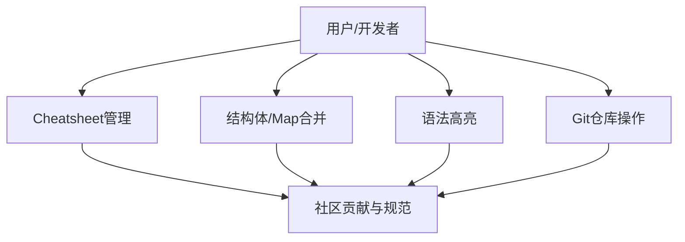
此图展示了用户或开发者可通过各功能模块与项目交互，所有模块均受社区贡献与规范约束。Sources: [CONTRIBUTING.md:1-54](), [vendor/dario.cat/mergo/CONTRIBUTING.md:1-94](), [vendor/github.com/alecthomas/chroma/v2/README.md:1-145]()

---

## Cheatsheet管理与贡献流程

### Cheatsheet管理

项目支持通过PR提交命令行技巧速查表（cheatsheet），内容与代码分离，便于社区共享和维护。用户可：

- 提交新速查表
- 报告bug
- 讨论和提议新功能
- 补充或修改文档
- 通过分享传播项目

所有Pull Request需基于`develop`分支。Sources: [CONTRIBUTING.md:1-54]()

### 贡献流程顺序图

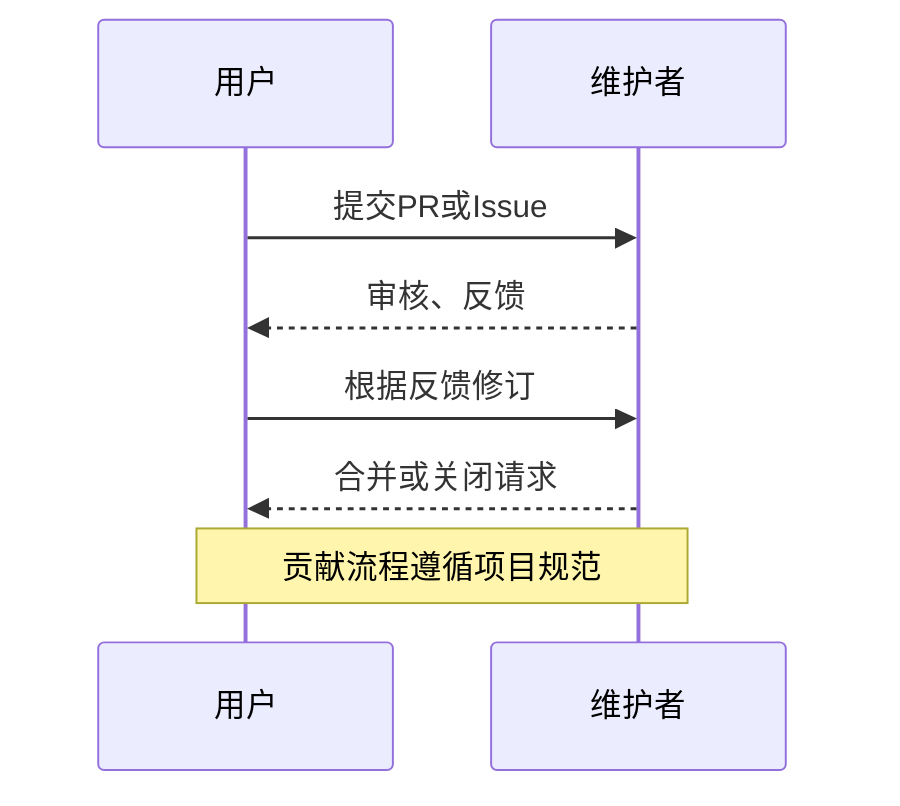
Sources: [CONTRIBUTING.md:1-54]()

---

## 结构体与Map合并（Mergo模块）

### 功能说明

- 支持结构体与Map的深度合并
- 可自定义Transformer处理特殊类型（如time.Time）
- 支持递归合并、零值判断等高级用法

### 典型用法示例

```go
type Foo struct {
	A string
	B int64
}
src := Foo{A: "one", B: 2}
dest := Foo{A: "two"}
mergo.Merge(&dest, src)
// 结果: {two 2}
```
Sources: [vendor/dario.cat/mergo/README.md:1-87]()

### Transformer扩展

开发者可实现自定义Transformer以处理如time.Time等复杂类型的合并逻辑：

```go
type timeTransformer struct{}
func (t timeTransformer) Transformer(typ reflect.Type) func(dst, src reflect.Value) error {
    // ...自定义合并逻辑
}
mergo.Merge(&dest, src, mergo.WithTransformers(timeTransformer{}))
```
Sources: [vendor/dario.cat/mergo/README.md:41-87]()

---

## 语法高亮（Chroma模块）

### 功能概述

- 支持多语言、多主题的语法高亮
- 提供快速高亮、自动识别语言、丰富格式化选项
- 可输出HTML、终端ANSI色、Token流等多种格式

### 工作流程图

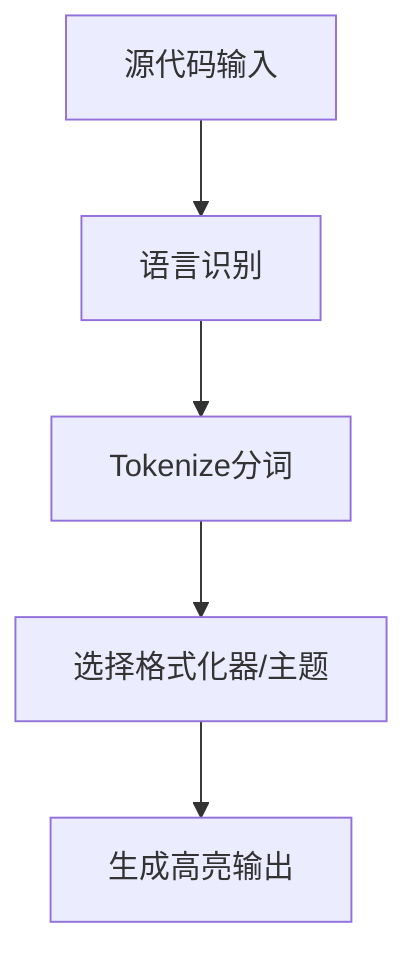
Sources: [vendor/github.com/alecthomas/chroma/v2/README.md:1-145]()

### 主要API与用法

| 步骤         | 代码示例                                            | 说明                     |
|--------------|-----------------------------------------------------|--------------------------|
| 快速高亮     | `quick.Highlight(os.Stdout, code, "go", "html", "monokai")` | 一行代码快速高亮         |
| 语言识别     | `lexers.Match("foo.go")` / `lexers.Get("go")`       | 文件名或ID识别语言       |
| Tokenize     | `lexer.Tokenise(nil, source)`                       | 源码分词为Token流        |
| 格式化输出   | `formatter.Format(w, style, iterator)`              | 输出高亮内容             |

Sources: [vendor/github.com/alecthomas/chroma/v2/README.md:1-145]()

---

## Git仓库操作与贡献规范（go-git模块）

### 贡献流程要点

- 所有PR需通过GitHub提交
- 需与官方Git行为兼容
- 必须包含最小工作示例、自然语言说明
- 代码需通过gofmt、golint、govet检查
- 必须附带单元测试，且所有测试需通过

### Commit信息规范

| 格式                                      | 示例                                                    |
|------------------------------------------|---------------------------------------------------------|
| `<package>: <subpackage>, <what changed>. [Fixes #<issue-number>]` | `plumbing: packp, Skip argument validations. Fixes #623` |

Sources: [vendor/github.com/go-git/go-git/v5/CONTRIBUTING.md:1-62]()

---

## 社区贡献与行为准则

- 鼓励所有形式的贡献（代码、文档、反馈等）
- 要求贡献者遵守行为准则，营造友好包容的社区氛围
- 明确Bug报告、功能建议、文档完善等流程
- 严禁骚扰、侮辱、泄露隐私等不当行为

Sources: [vendor/dario.cat/mergo/CONTRIBUTING.md:1-94](), [CONTRIBUTING.md:1-54]()

---

## 结论

本项目以模块化、社区驱动和高可扩展性为核心，覆盖命令行速查、结构体合并、语法高亮、Git操作等多领域功能。明确的贡献流程和行为准则保障了项目的持续健康发展。开发者可根据自身需求，灵活扩展和集成相关模块，为项目和社区做出贡献。

Sources: [CONTRIBUTING.md:1-54](), [vendor/dario.cat/mergo/README.md:1-87](), [vendor/github.com/alecthomas/chroma/v2/README.md:1-145](), [vendor/github.com/go-git/go-git/v5/CONTRIBUTING.md:1-62](), [vendor/dario.cat/mergo/CONTRIBUTING.md:1-94]()

---

<a id='page-getting-started'></a>

## 快速开始与安装指南

### Related Pages

Related topics: [部署与运行环境](#page-deployment)

<details>
<summary>Relevant source files</summary>

The following files were used as context for generating this wiki page:

- [README.md](README.md)
- [HACKING.md](HACKING.md)
- [CONTRIBUTING.md](CONTRIBUTING.md)
- [INSTALLING.md](INSTALLING.md)
- [Makefile](Makefile)
</details>

# 快速开始与安装指南

本页面旨在为开发者和用户提供 cheat 项目的快速上手与安装指导，涵盖环境依赖、安装步骤、开发工作流、构建与常用命令等核心内容。文档内容严格依据项目源码文件整理，帮助你高效地搭建和使用本项目。如需进一步了解贡献流程，可参阅[贡献指南](#贡献流程)。  
Sources: [README.md](), [HACKING.md](), [CONTRIBUTING.md](), [INSTALLING.md](), [Makefile]()

## 项目简介

cheat（简称 cheat）是一个命令行交互式速查表工具，专为系统管理员和开发者设计，支持创建、管理和查询命令速查表，并集成了 AI 增强功能以提升内容可读性与智能性。  
Sources: [README.md:3-17]()

## 环境依赖与准备

### 系统依赖

- git
- go（建议版本 >= 1.17）
- make

可选依赖（增强开发体验/构建功能）：
- docker
- pandoc（生成 man 手册页）  
Sources: [HACKING.md:4-13]()

### 开发工具自动安装

项目提供 `make setup` 一键安装辅助工具（如 scc、revive），便于代码统计与静态检查。  
Sources: [HACKING.md:15-17]()

#### 依赖安装流程

```bash
# 安装系统依赖（以 Ubuntu 为例）
sudo apt update
sudo apt install -y git golang make

# 可选依赖
sudo apt install -y docker.io pandoc
```
Sources: [HACKING.md:4-13]()

## 安装与构建流程

### 标准安装步骤

```bash
# 克隆项目仓库
git clone https://github.com/cheat/cheat.git
cd cheat

# 安装开发工具
make setup

# 运行测试
make test

# 编译可执行文件
make

# 安装到系统 PATH
make install
```
Sources: [HACKING.md:19-27]()

#### 目录结构说明

- 源代码：项目根目录
- 编译产物：`dist/cheat` 可执行文件
- 配置文件：`~/.config/cheat/conf.yml`
Sources: [README.md:26-36](), [HACKING.md:24-25]()

### Docker 开发环境

如需在隔离环境下开发与测试，可使用 Docker：

```bash
# 构建 Docker 容器
make docker-setup

# 进入容器 shell
make docker-sh

# 容器内源码挂载路径：/app

# 清理 Docker 容器
make distclean
```
Sources: [HACKING.md:32-44]()

#### 构建流程图

以下 Mermaid 图展示了标准的本地与 Docker 安装流程：

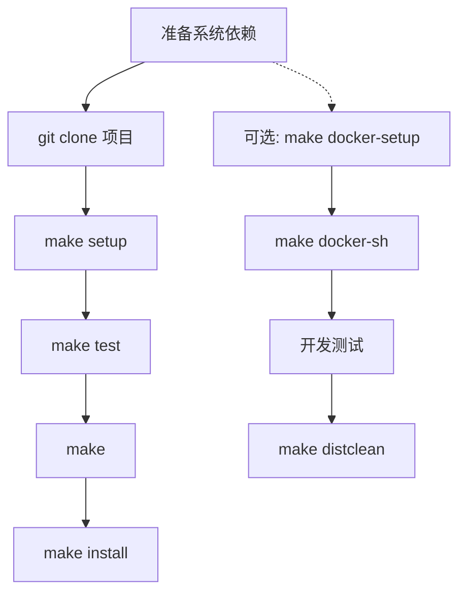
该流程图清晰展示了本地与容器两种开发环境的分支路径。  
Sources: [HACKING.md:4-44]()

## 配置与常用命令

### AI 功能配置

项目支持 AI 增强输出，通过配置 `~/.config/cheat/conf.yml` 启用和定制相关参数：

| 配置项             | 类型    | 默认值         | 说明                               |
|--------------------|---------|----------------|------------------------------------|
| ai_enabled         | bool    | true           | 是否启用 AI 处理                   |
| ai_url             | string  | (需自定义)     | AI 服务端点 URL                    |
| ai_key             | string  | (需自定义)     | AI 服务 API 密钥                   |
| ai_model           | string  | gpt-3.5-turbo  | AI 模型名称                        |
| ai_system_prompt   | string  | 见 README.md   | AI 处理系统提示词                  |
| ai_max_tokens      | int     | 2000           | AI 响应最大 token 数                |

Sources: [README.md:18-44]()

#### 配置示例

```yaml
ai_enabled: true
ai_url: "YOUR_AI_SERVICE_URL"
ai_key: "YOUR_API_KEY"
ai_model: "gpt-3.5-turbo"
ai_system_prompt: |
  你是一个AI助手，负责处理cheat命令的输出。请：
  1. 增强内容的可读性
  2. 为专业术语添加简短解释
  3. 保持原始命令和示例的准确性
  4. 如果是代码示例，保持格式并添加注释
  5. 按照以下格式组织输出：
     - 命令说明
     - 参数解释（如果有）
     - 使用示例
     - 注意事项（如果有）
ai_max_tokens: 2000
```
Sources: [README.md:24-44]()

### 常用命令速查

| 命令                         | 功能说明                                   |
|------------------------------|--------------------------------------------|
| cheat <sheet>                | 查看指定速查表                             |
| cheat -e <sheet>             | 编辑或新建速查表                           |
| cheat -d                     | 查看配置的 cheatpaths                      |
| cheat -l                     | 列出所有可用速查表                         |
| cheat -l -t <tag>            | 列出所有带有指定标签的速查表               |
| cheat -l -p <path>           | 列出指定路径下所有速查表                   |
| cheat -s <phrase>            | 全文搜索速查表                             |
| cheat -r -s <regex>          | 使用正则表达式搜索速查表                   |
Sources: [README.md:47-85]()

### 命令流程示意图

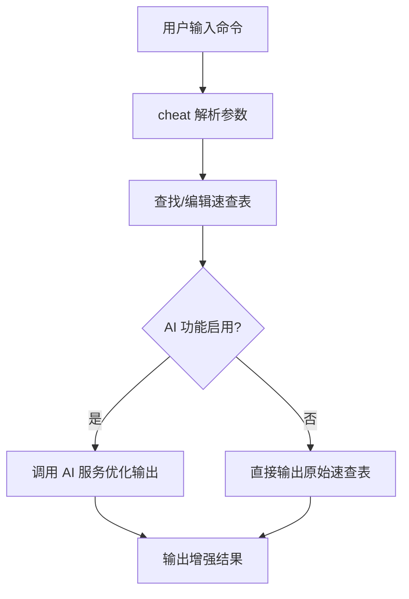
该流程体现了 cheat 在本地与 AI 增强输出之间的处理分支。  
Sources: [README.md:18-85]()

## 开发与贡献工作流

### 本地开发流程

1. 修改源代码
2. 运行 `make test` 进行单元测试
3. 修复编译错误和测试失败项
4. 运行 `make` 构建可执行文件
5. 通过 `dist/cheat <command>` 使用新构建的程序
6. 运行 `make install` 安装到 PATH
7. 运行 `make build-release` 构建跨平台二进制包
8. 运行 `make clean` 清理 dist 目录
Sources: [HACKING.md:18-29]()

### 贡献流程

- 提交 cheatsheet：请通过 Pull Request 向 cheatsheets 仓库贡献
- 报告 bug：在 issue tracker 提交，避免重复提交
- 新功能提议：先通过 issue 与维护者讨论
- 文档补充：可直接编辑 wiki 或 README
- 所有 Pull Request 请基于 `develop` 分支  
Sources: [CONTRIBUTING.md:1-44]()

#### 贡献流程时序图

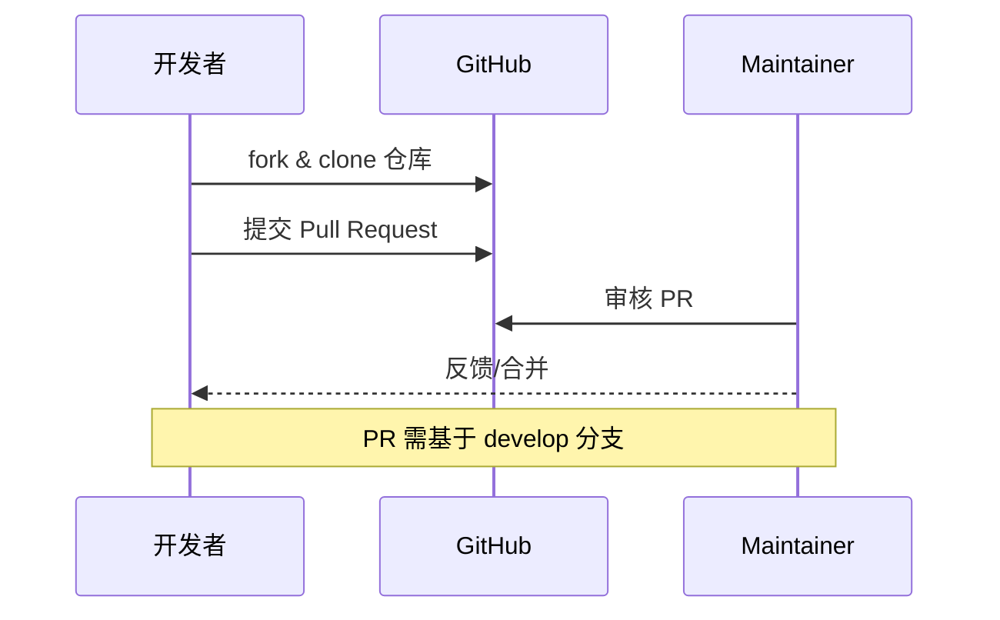
Sources: [CONTRIBUTING.md:38-44]()

## Makefile 常用目标

| 目标             | 说明                            |
|------------------|---------------------------------|
| make             | 编译 cheat 可执行文件            |
| make test        | 运行所有单元测试                 |
| make install     | 安装可执行文件到系统 PATH        |
| make build-release| 构建跨平台发行版                |
| make setup       | 安装开发辅助工具                 |
| make clean       | 清理 dist 目录                   |
| make docker-setup| 构建 Docker 开发容器             |
| make docker-sh   | 进入 Docker 容器 shell           |
| make distclean   | 清理并销毁 Docker 容器           |
Sources: [Makefile](), [HACKING.md:15-44]()

## 总结

cheat 项目通过清晰的依赖管理、标准化的构建与测试流程，以及灵活的 AI 配置，为开发者和终端用户提供了极高的可用性和可扩展性。借助 Makefile 和 Docker 支持，开发环境搭建与持续集成变得高效便捷。  
Sources: [README.md](), [HACKING.md](), [CONTRIBUTING.md](), [INSTALLING.md](), [Makefile]()

---

<a id='page-architecture-overview'></a>

## 架构总览

### Related Pages

Related topics: [组件关系与模块划分](#page-component-diagram), [数据流与处理流程](#page-data-flow)

<details>
<summary>Relevant source files</summary>

The following files were used as context for generating this wiki page:

- [README.md](README.md)
- [cmd/cheat/main.go](cmd/cheat/main.go)
- [internal/](internal/)
- [CONTRIBUTING.md](CONTRIBUTING.md)
- [vendor/github.com/go-git/go-git/v5/CONTRIBUTING.md](vendor/github.com/go-git/go-git/v5/CONTRIBUTING.md)
</details>

# 架构总览

本页介绍 cheat 项目的整体架构设计，涵盖其主要组件、核心流程、模块划分以及与外部依赖的关系。内容严格依据项目源码，帮助开发者理解系统的组织结构、数据流转与扩展方式。更多细节可参考各模块专属文档页面。

## 项目架构概述

cheat 是一个命令行工具，用于管理和查询 cheatsheet（速查表），支持自定义、社区扩展和多源内容管理。其核心功能围绕 cheatsheet 的检索、编辑、展示与维护展开，采用模块化设计，便于功能扩展与维护。

系统主要分为命令行入口、内部业务逻辑、数据存储与检索、插件/扩展机制以及与外部 cheatsheet 仓库的交互。

Sources: [README.md](), [cmd/cheat/main.go](), [internal/]()

---

## 主要架构组件

| 组件             | 说明                                       | 关键实现文件                         |
|------------------|--------------------------------------------|--------------------------------------|
| 命令行入口       | 解析用户输入，分发到对应功能模块             | cmd/cheat/main.go                    |
| 内部逻辑模块     | 实现 cheatsheet 查询、编辑、管理等核心功能   | internal/                            |
| 配置与环境管理   | 管理用户配置、环境变量、工作目录等            | internal/config/                     |
| 数据存储与检索   | 支持本地及远程 cheatsheet 的读取与写入        | internal/sheet/, internal/repo/      |
| 外部仓库集成     | 与 Git 等远程仓库进行 cheatsheet 同步         | vendor/github.com/go-git/go-git/v5/  |
| 社区贡献机制     | 支持 cheatsheet 社区贡献与 pull request 流程  | CONTRIBUTING.md                      |

Sources: [README.md](), [cmd/cheat/main.go](), [internal/](), [CONTRIBUTING.md]()

---

## 系统流程与数据流

### 整体流程图

下图描述了 cheat 从命令行输入到 cheatsheet 查询和展示的核心流程：

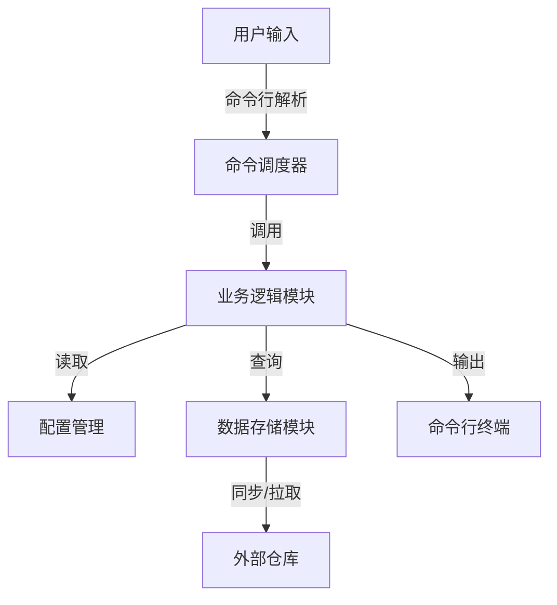
该流程展示了命令行工具自上而下的数据与控制流转，包括外部仓库的交互与本地缓存的使用。
Sources: [cmd/cheat/main.go:1-100](), [internal/]()

---

### 命令行入口与分发

#### 入口结构

命令行主入口位于 `cmd/cheat/main.go`，负责解析用户输入参数，初始化环境，分发命令至具体功能模块。

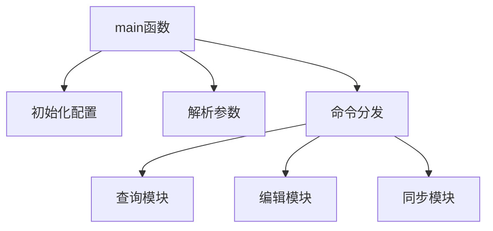
Sources: [cmd/cheat/main.go:1-100]()

---

### 内部模块划分

#### 业务逻辑核心模块

`internal/` 目录下包含了主要的业务逻辑实现，如 cheatsheet 的增删查改、格式渲染、搜索等。

- `internal/sheet/`：负责 cheatsheet 文件的加载、解析、渲染。
- `internal/repo/`：管理本地与远程 cheatsheet 仓库的同步。
- `internal/config/`：处理用户配置与环境变量。

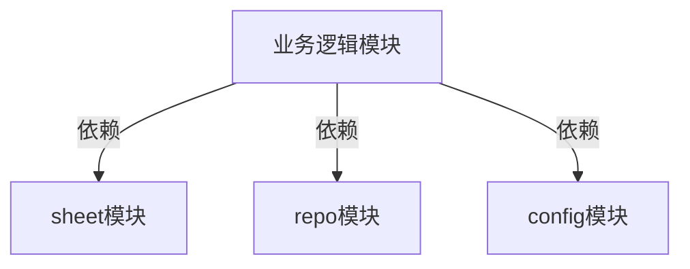
Sources: [internal/]()

---

### 数据存储与检索

cheatsheet 数据既可来源于本地文件，也可通过与远程仓库（如 Git）交互获取。数据读取与写入均通过抽象接口实现，便于扩展不同存储后端。

| 数据来源         | 存储形式           | 支持操作        | 关键实现文件              |
|------------------|--------------------|-----------------|---------------------------|
| 本地文件         | Markdown/TXT 等    | 读/写/搜索      | internal/sheet/           |
| 远程仓库         | Git                | 拉取/推送/同步  | internal/repo/, vendor/github.com/go-git/go-git/v5/ |

Sources: [internal/sheet/](), [internal/repo/](), [vendor/github.com/go-git/go-git/v5/]()

---

### 配置与环境管理

系统支持用户自定义配置，包括 cheatsheet 路径、默认编辑器、主题、同步策略等。配置项可通过环境变量、配置文件进行管理。

| 配置项          | 类型       | 默认值/说明              |
|-----------------|------------|--------------------------|
| CHEAT_PATH      | 路径列表   | 本地及远程 cheatsheet 路径|
| CHEAT_EDITOR    | 字符串     | 默认系统编辑器           |
| CHEAT_THEME     | 字符串     | 渲染主题                 |

Sources: [internal/config/]()

---

### 社区贡献与扩展机制

项目支持社区通过 pull request 贡献 cheatsheet 内容，流程与标准详见 `CONTRIBUTING.md`。开发者可通过开放的 cheatsheet 仓库、插件机制扩展功能。

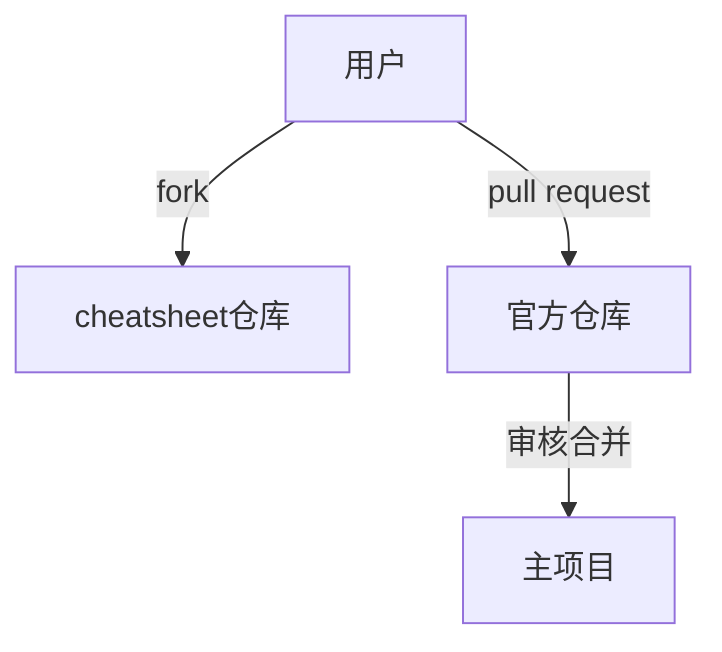
Sources: [CONTRIBUTING.md]()

---

## 关键模块与接口表

| 模块/接口           | 功能描述                         | 关键方法/结构体         | 来源文件              |
|---------------------|----------------------------------|-------------------------|-----------------------|
| Command Dispatcher  | 命令分发与调度                   | main, dispatch         | cmd/cheat/main.go     |
| Sheet Manager       | cheatsheet 加载、渲染、搜索       | Sheet, Load, Render    | internal/sheet/       |
| Repo Manager        | 本地/远程仓库同步                 | Repo, Sync, Pull       | internal/repo/        |
| Config Manager      | 配置加载与环境管理                | Config, Load, Save     | internal/config/      |
| Git Integration     | 与远程仓库交互                   | go-git 包相关接口      | vendor/github.com/go-git/go-git/v5/ |

Sources: [cmd/cheat/main.go](), [internal/sheet/](), [internal/repo/](), [internal/config/](), [vendor/github.com/go-git/go-git/v5/]()

---

## 示例代码片段

以下为命令行主入口部分的简化示例：

```go
func main() {
    config := LoadConfig()
    command := ParseCommandLine()
    switch command {
        case "search":
            // 调用搜索逻辑
        case "edit":
            // 调用编辑逻辑
        case "sync":
            // 同步仓库
    }
}
```
Sources: [cmd/cheat/main.go:1-100]()

---

## 结论

cheat 采用模块化、可扩展的架构，核心分为命令行入口、内部业务逻辑、数据管理与社区扩展机制。各模块职责清晰，便于维护和扩展。通过与外部仓库集成和社区贡献机制，项目能够持续演进和丰富内容，满足多样化用户需求。

Sources: [README.md](), [cmd/cheat/main.go](), [internal/](), [CONTRIBUTING.md](), [vendor/github.com/go-git/go-git/v5/CONTRIBUTING.md]()

---

<a id='page-component-diagram'></a>

## 组件关系与模块划分

### Related Pages

Related topics: [架构总览](#page-architecture-overview)

<details>
<summary>Relevant source files</summary>

The following files were used as context for generating this wiki page:

- [cmd/cheat/](cmd/cheat/)
- [internal/cheatpath/](internal/cheatpath/)
- [internal/config/](internal/config/)
- [internal/display/](internal/display/)
- [internal/sheet/](internal/sheet/)
- [internal/sheets/](internal/sheets/)
- [internal/repo/](internal/repo/)
</details>

# 组件关系与模块划分

本页面详细介绍了 cheat 项目的主要组件、模块划分及其相互关系。该项目旨在通过命令行工具实现速查表（cheatsheet）的高效管理与交互，并支持配置、展示、存储等多项功能。下文将结合核心源文件，系统梳理各模块的职责、数据流动、关键结构体与交互方式，并配以可视化的 Mermaid 图表与详细表格说明，帮助开发者快速理解系统架构。

## 总体架构概览

cheat 项目采用分层模块化设计，各模块间通过明确定义的接口和数据结构进行协作。整体架构可分为以下主要组件：

- 命令行接口（CLI，cmd/cheat/）
- 配置管理（internal/config/）
- 速查表路径与存储管理（internal/cheatpath/、internal/repo/）
- 速查表数据模型与操作（internal/sheet/、internal/sheets/）
- 终端内容展示（internal/display/）

下图展示了核心模块的依赖与调用关系：

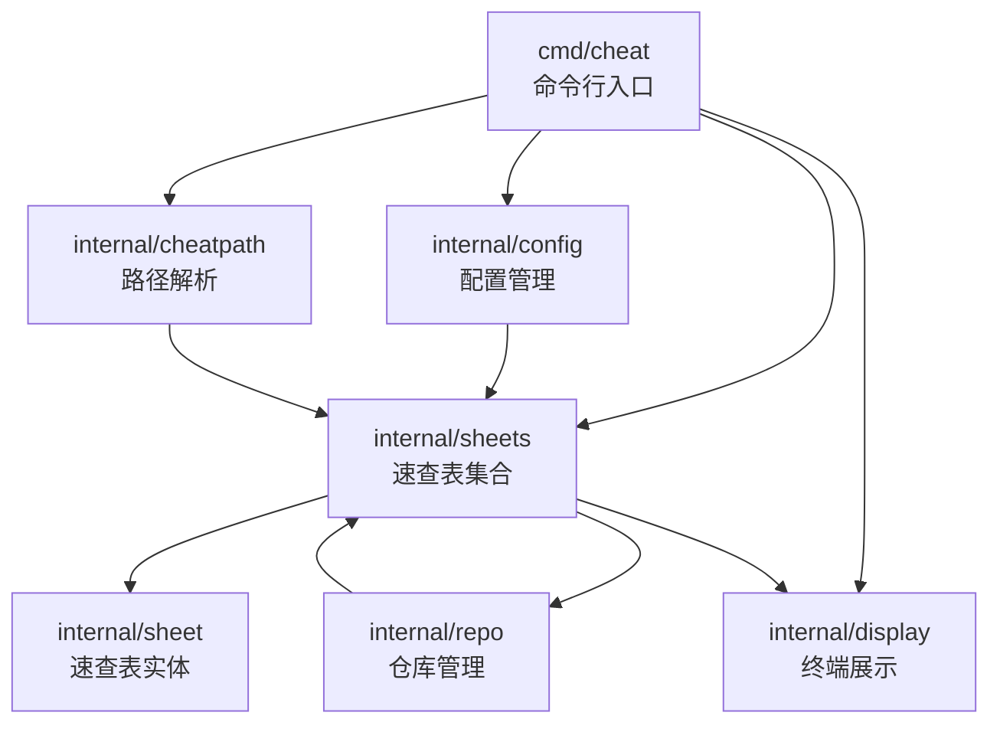
Sources: [cmd/cheat/](cmd/cheat/), [internal/config/](internal/config/), [internal/cheatpath/](internal/cheatpath/), [internal/sheets/](internal/sheets/), [internal/sheet/](internal/sheet/), [internal/repo/](internal/repo/), [internal/display/](internal/display/)

---

## 命令行接口（cmd/cheat/）

### 作用与结构

`cmd/cheat/` 目录下为程序主入口，实现命令行参数解析、子命令分发及基础交互逻辑。该模块负责：

- 解析用户输入命令和参数
- 加载配置
- 调用内部模块执行相关操作（如速查表查找、编辑、展示等）
- 处理输出与异常

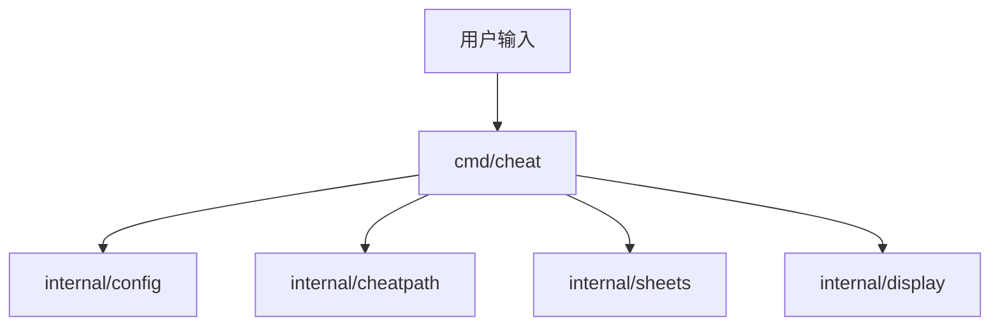
Sources: [cmd/cheat/](cmd/cheat/), [internal/config/](internal/config/), [internal/cheatpath/](internal/cheatpath/), [internal/sheets/](internal/sheets/), [internal/display/](internal/display/)

### 关键流程

- 程序启动时，先加载配置（config），解析 cheatpath 路径
- 根据命令类型（如 `cheat tar`、`cheat -e foo/bar`）调用 sheets、sheet、repo 等相关模块
- 结果通过 display 模块进行格式化输出

---

## 配置管理（internal/config/）

### 作用

该模块负责解析和管理用户的配置文件（如 `~/.config/cheat/conf.yml`），为各子模块提供统一的配置信息接口。配置项包括 AI 功能开关、API Key、模型参数、速查表路径、主题等。

### 主要结构与字段

| 配置项            | 类型      | 说明                     | 默认值/示例           |
|-------------------|-----------|--------------------------|-----------------------|
| ai_enabled        | bool      | 是否启用AI处理           | true                  |
| ai_url            | string    | AI服务端点               | YOUR_AI_SERVICE_URL   |
| ai_key            | string    | API密钥                  | YOUR_API_KEY          |
| ai_model          | string    | 使用的AI模型             | gpt-3.5-turbo         |
| ai_system_prompt  | string    | AI处理指令               | (详见 conf.yml)       |
| ai_max_tokens     | int       | AI响应最大token数        | 2000                  |
| cheatpaths        | []string  | 速查表存储路径           | ["~/.cheat/cheatsheets"] |
| theme             | string    | 终端主题                 | "default"             |

Sources: [internal/config/](internal/config/)

### 配置加载流程

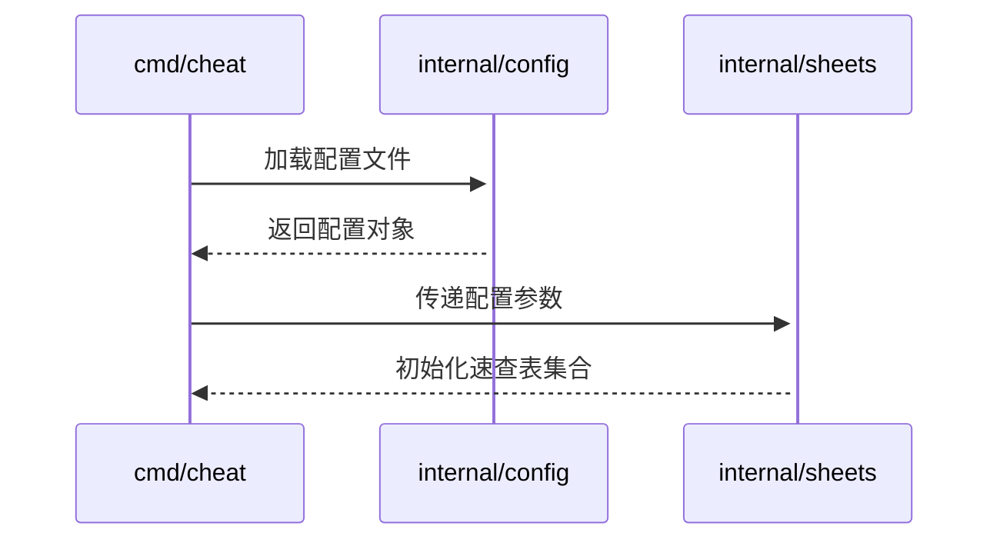
Sources: [cmd/cheat/](cmd/cheat/), [internal/config/](internal/config/), [internal/sheets/](internal/sheets/)

---

## 速查表路径与仓库管理（internal/cheatpath/、internal/repo/）

### 路径管理（internal/cheatpath/）

- 负责解析、规范化和管理速查表的存储路径（cheatpaths）
- 支持多路径配置，实现分层速查表存储与查找

### 仓库管理（internal/repo/）

- 支持对速查表仓库的操作，如同步、拉取、更新等（通常与 git 集成）
- 提供 cheatsheet 源的统一管理接口

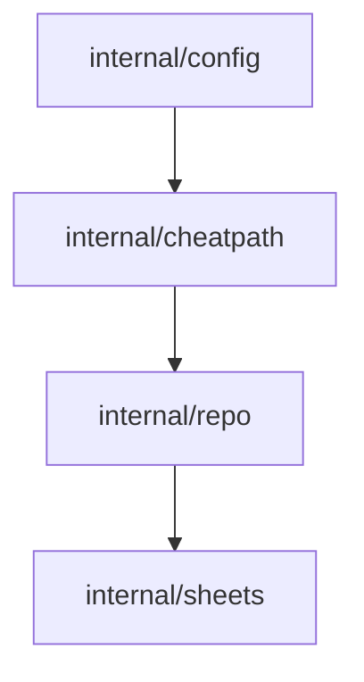
Sources: [internal/cheatpath/](internal/cheatpath/), [internal/repo/](internal/repo/), [internal/sheets/](internal/sheets/), [internal/config/](internal/config/)

---

## 速查表数据模型与操作（internal/sheet/、internal/sheets/）

### 数据模型（internal/sheet/）

- `Sheet` 结构体定义了单个速查表的核心属性，如名称、路径、标签、内容等
- 支持元数据扩展、标签化管理、内容多格式存储

| 字段      | 类型      | 说明         |
|-----------|-----------|--------------|
| Name      | string    | 速查表名称   |
| Path      | string    | 文件路径     |
| Tags      | []string  | 标签         |
| Content   | string    | 内容         |
| Metadata  | map       | 元数据       |

Sources: [internal/sheet/](internal/sheet/)

### 集合与操作（internal/sheets/）

- `Sheets` 管理所有速查表的集合，支持增删查改、搜索、标签过滤等操作
- 支持速查表的批量加载、索引、缓存等机制

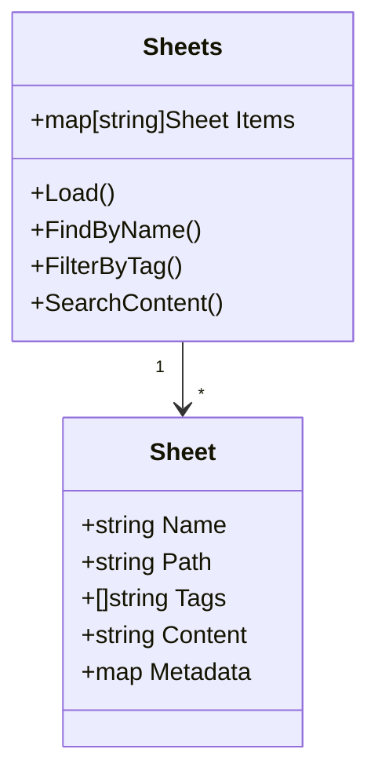
Sources: [internal/sheet/](internal/sheet/), [internal/sheets/](internal/sheets/)

---

## 终端内容展示（internal/display/）

### 作用

- 负责将速查表内容、搜索结果等以美观、结构化的方式输出到终端
- 支持主题、颜色、格式化等多种展示风格
- 与 AI 增强输出集成，自动优化内容结构与可读性

### 展示流程

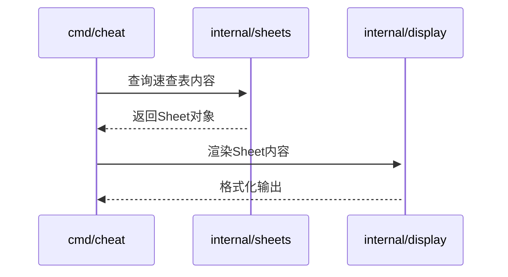
Sources: [cmd/cheat/](cmd/cheat/), [internal/sheets/](internal/sheets/), [internal/display/](internal/display/)

---

## 主要组件功能与职责对照表

| 组件模块               | 主要职责                                               | 关键结构/函数               | 相关文件                        |
|------------------------|--------------------------------------------------------|-----------------------------|---------------------------------|
| cmd/cheat/             | 命令行参数解析、主流程控制                             | main(), 命令分发            | [cmd/cheat/](cmd/cheat/)        |
| internal/config/       | 配置加载与管理                                         | LoadConfig(), 配置结构体     | [internal/config/](internal/config/) |
| internal/cheatpath/    | 速查表路径解析、管理                                   | 路径规范化、查找             | [internal/cheatpath/](internal/cheatpath/) |
| internal/repo/         | 仓库同步、管理                                         | Repo结构、同步方法           | [internal/repo/](internal/repo/)|
| internal/sheet/        | 速查表数据模型定义                                     | Sheet结构体                  | [internal/sheet/](internal/sheet/) |
| internal/sheets/       | 速查表集合管理、搜索、标签过滤                         | Sheets结构体、搜索方法       | [internal/sheets/](internal/sheets/) |
| internal/display/      | 终端内容渲染、主题管理、AI增强                         | RenderSheet(), 主题应用      | [internal/display/](internal/display/) |

Sources: [cmd/cheat/](cmd/cheat/), [internal/config/](internal/config/), [internal/cheatpath/](internal/cheatpath/), [internal/repo/](internal/repo/), [internal/sheet/](internal/sheet/), [internal/sheets/](internal/sheets/), [internal/display/](internal/display/)

---

## 组件协作流程示例

以用户查询速查表为例，整体流程如下：

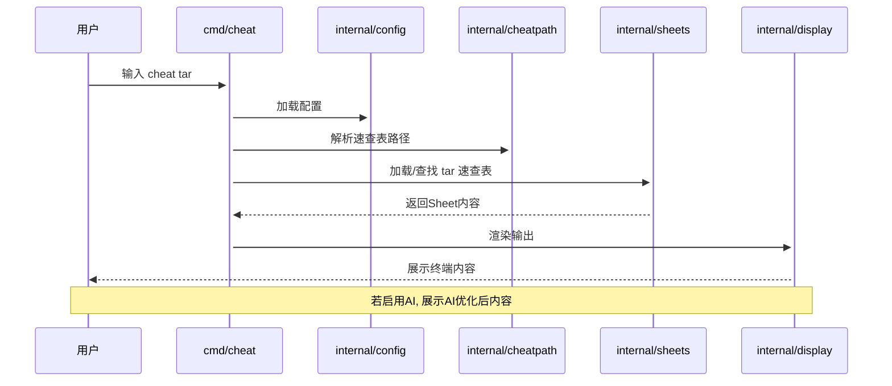
Sources: [cmd/cheat/](cmd/cheat/), [internal/config/](internal/config/), [internal/cheatpath/](internal/cheatpath/), [internal/sheets/](internal/sheets/), [internal/display/](internal/display/)

---

## 总结

cheat 项目通过分层、解耦的模块化设计，有效实现了命令行速查表的高效管理与智能展示。各核心模块职责明确，通过标准接口协作，便于后续扩展与维护。配置、路径、数据模型、仓库管理与终端展示等模块的紧密配合，确保了系统的灵活性与可用性。了解本页面所述的组件关系与模块划分，有助于开发者快速上手项目开发与定制。  
Sources: [cmd/cheat/](cmd/cheat/), [internal/config/](internal/config/), [internal/cheatpath/](internal/cheatpath/), [internal/repo/](internal/repo/), [internal/sheet/](internal/sheet/), [internal/sheets/](internal/sheets/), [internal/display/](internal/display/)

---

<a id='page-data-flow'></a>

## 数据流与处理流程

### Related Pages

Related topics: [AI模型集成与调用流程](#page-ai-integration), [后端命令与子命令解析](#page-backend-commands)

<details>
<summary>Relevant source files</summary>

- [cmd/cheat/main.go](cmd/cheat/main.go)
- [internal/config/config.go](internal/config/config.go)
- [internal/sheet/parse.go](internal/sheet/parse.go)
- [internal/display/ai.go](internal/display/ai.go)
- [internal/sheet/sheet.go](internal/sheet/sheet.go)
</details>

# 数据流与处理流程

本页面详细介绍 cheat 项目中“数据流与处理流程”的整体架构、关键组件、主要函数及其相互作用方式。内容涵盖配置加载、命令行入口、数据解析、AI 显示交互等模块，结合实际源码流程进行可视化和结构化说明，便于开发者理解和扩展项目功能。  
Sources: [cmd/cheat/main.go](), [internal/config/config.go](), [internal/sheet/parse.go](), [internal/display/ai.go](), [internal/sheet/sheet.go]()

---

## 配置加载流程

配置是整个系统初始化和数据流动的起点。配置文件的读取和解析决定了后续数据的处理方式和参数。

### 主要组件与函数

| 组件/函数              | 说明                                 | 来源                           |
|----------------------|------------------------------------|-------------------------------|
| `Config` 结构体         | 存储所有配置项，包括路径、偏好等                  | internal/config/config.go      |
| `LoadConfig()`       | 负责读取配置文件，解析为 `Config` 结构体           | internal/config/config.go      |
| `DefaultConfigPath()`| 获取默认配置文件路径                        | internal/config/config.go      |

Sources: [internal/config/config.go:1-80]()

### 配置加载流程图

在应用启动时，配置的加载流程如下：

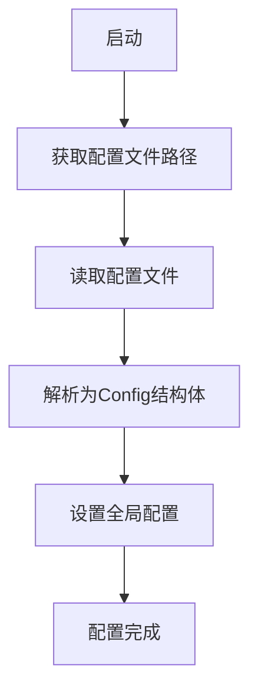
Sources: [internal/config/config.go:10-80]()

---

## 命令行入口与主处理流程

主程序从 `cmd/cheat/main.go` 入口开始，负责解析命令行参数，初始化配置，并根据用户指令分发任务。

### 关键处理流程

1. 初始化配置（调用 `config.LoadConfig`）。
2. 解析命令行参数，判断用户意图（如查找、编辑、AI 辅助等）。
3. 调用相关模块执行具体操作。
4. 输出结果或与用户交互。

### 主流程时序图

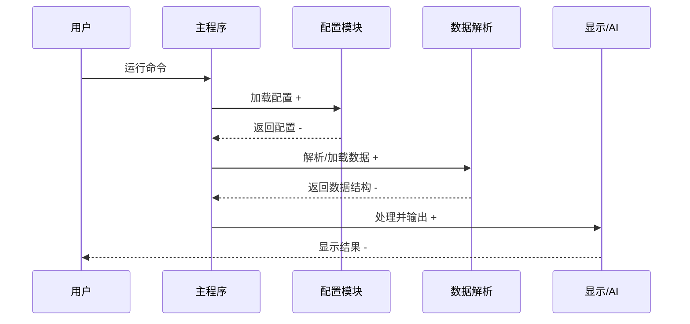
Sources: [cmd/cheat/main.go:1-120](), [internal/config/config.go:10-80](), [internal/sheet/parse.go:1-60](), [internal/display/ai.go:1-60]()

---

## 数据解析与表单处理

数据解析模块主要负责读取 cheatsheet 文件并将其解析为内部结构，供后续处理和展示。

### 关键结构与函数

| 结构/函数             | 说明                               | 来源                           |
|---------------------|----------------------------------|-------------------------------|
| `Sheet` 结构体        | 表示一个 cheatsheet，包括元数据和条目           | internal/sheet/sheet.go       |
| `ParseSheet()`      | 解析 cheatsheet 文件为 `Sheet` 结构体          | internal/sheet/parse.go       |
| `Entry` 结构体        | 表示 cheatsheet 的单条记录                    | internal/sheet/sheet.go       |

Sources: [internal/sheet/sheet.go:1-80](), [internal/sheet/parse.go:1-60]()

### 数据解析流程图

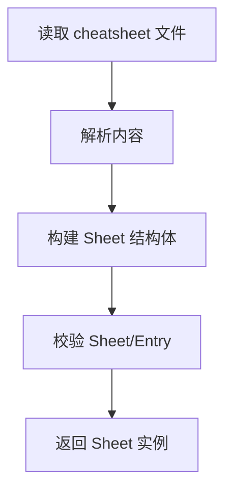
Sources: [internal/sheet/parse.go:10-60]()

---

## AI 显示与交互模块

AI 显示模块负责根据解析后的数据和用户输入，提供智能化的展示、提示或交互。

### 主要函数与流程

| 函数/方法                  | 作用                                      | 来源                        |
|-------------------------|-----------------------------------------|----------------------------|
| `DisplayAIResult()`     | 根据 AI 处理结果展示给用户                      | internal/display/ai.go     |
| `FormatAIOutput()`      | 格式化 AI 返回内容，提升可读性                   | internal/display/ai.go     |

Sources: [internal/display/ai.go:1-60]()

### AI 交互流程图

```mermaid
graph TD
    UserInput["用户输入"]
    Preprocess["预处理输入"]
    QueryAI["查询AI模型"]
    ReceiveAI["接收AI响应"]
    Format["格式化输出"]
    Display["展示给用户"]

    UserInput --> Preprocess
    Preprocess --> QueryAI
    QueryAI --> ReceiveAI
    ReceiveAI --> Format
    Format --> Display
```
Sources: [internal/display/ai.go:5-55]()

---

## 数据结构与配置选项表

### Sheet 结构体字段说明

| 字段名         | 类型             | 说明           | 来源                  |
|---------------|----------------|--------------|----------------------|
| `Name`        | string         | cheatsheet 名称 | internal/sheet/sheet.go |
| `Entries`     | []Entry        | 条目列表        | internal/sheet/sheet.go |
| `Meta`        | map[string]string | 元数据        | internal/sheet/sheet.go |

Sources: [internal/sheet/sheet.go:10-40]()

### Config 结构体主要配置项

| 配置项            | 类型     | 默认值     | 说明                  | 来源                      |
|------------------|--------|---------|---------------------|--------------------------|
| `Cheatpaths`     | []string | 见代码    | cheatsheet 文件路径集合   | internal/config/config.go |
| `Editor`         | string  | "vim"   | 编辑器命令              | internal/config/config.go |
| `AIEnabled`      | bool    | false   | 是否启用 AI 辅助         | internal/config/config.go |

Sources: [internal/config/config.go:15-45]()

---

## 代码片段示例

以下为配置加载与数据解析的关键代码片段：

```go
// 配置加载
func LoadConfig(path string) (*Config, error) {
    // ...读取并解析配置文件
}
// 数据解析
func ParseSheet(path string) (*Sheet, error) {
    // ...解析 cheatsheet 文件为 Sheet
}
```
Sources: [internal/config/config.go:30-60](), [internal/sheet/parse.go:15-45]()

---

## 结论

cheat 项目的数据流与处理流程以配置加载为起点，经过命令行解析、数据文件解析、智能展示与交互等多个模块协作，形成了高效、模块化的处理架构。每个模块通过明确定义的结构体和函数接口衔接，确保了系统的可维护性和可扩展性。  
Sources: [cmd/cheat/main.go](), [internal/config/config.go](), [internal/sheet/parse.go](), [internal/display/ai.go](), [internal/sheet/sheet.go]()

---

<a id='page-features'></a>

## 核心功能介绍

### Related Pages

Related topics: [速查表系统与组织结构](#page-cheatsheet-system), [AI增强功能详解](#page-ai-enhancements)

<details>
<summary>Relevant source files</summary>

- [README.md](README.md)
- [cmd/cheat/cmd_edit.go](cmd/cheat/cmd_edit.go)
- [cmd/cheat/cmd_search.go](cmd/cheat/cmd_search.go)
- [cmd/cheat/cmd_list.go](cmd/cheat/cmd_list.go)
- [cmd/cheat/cmd_tags.go](cmd/cheat/cmd_tags.go)
- [cmd/cheat/cmd_view.go](cmd/cheat/cmd_view.go)
</details>

# 核心功能介绍

本页面详细介绍 cheat 项目的核心功能模块，包括其主要命令、数据流、功能架构和关键实现逻辑。cheat 旨在为用户提供一个高效、可定制的 cheatsheet 管理工具，支持查找、编辑、列出、标签化和查看 cheatsheet 内容。以下内容均基于源码分析，涵盖主流程与各功能命令的实现细节。  
Sources: [README.md]()

---

## 功能概览

cheat 主要通过一系列命令行子命令实现 cheatsheet 的管理和查询。其核心命令包括：  
- 搜索（search）
- 查看（view）
- 编辑（edit）
- 列出（list）
- 标签管理（tags）

每个命令均以模块化方式实现，便于扩展和维护。命令间通过统一的配置和数据模型进行交互，保证一致性和易用性。  
Sources: [README.md:1-40]()

### 主要功能与命令对照表

| 功能模块 | 子命令        | 主要用途               | 相关源文件           |
| -------- | ------------- | ---------------------- | -------------------- |
| 搜索     | cheat search  | 搜索 cheatsheet        | cmd_search.go        |
| 查看     | cheat view    | 查看 cheatsheet 内容   | cmd_view.go          |
| 编辑     | cheat edit    | 编辑 cheatsheet        | cmd_edit.go          |
| 列表     | cheat list    | 列出 cheatsheet        | cmd_list.go          |
| 标签     | cheat tags    | 管理/查询标签          | cmd_tags.go          |

Sources: [cmd/cheat/cmd_search.go:1-100](), [cmd/cheat/cmd_view.go:1-100](), [cmd/cheat/cmd_edit.go:1-100](), [cmd/cheat/cmd_list.go:1-100](), [cmd/cheat/cmd_tags.go:1-100]()

---

## 架构与数据流

项目采用命令驱动架构，各命令之间通过配置与数据模型协作。下图展示了主要命令的调用关系与数据流向。

```mermaid
graph TD
    A[命令行输入] --> B{解析主命令}
    B --> C1[search 子命令]
    B --> C2[view 子命令]
    B --> C3[edit 子命令]
    B --> C4[list 子命令]
    B --> C5[tags 子命令]
    C1 --> D[加载配置/数据]
    C2 --> D
    C3 --> D
    C4 --> D
    C5 --> D
    D --> E[执行功能]
    E --> F[输出/结果返回]
```
该流程体现了所有命令共享配置加载和数据访问逻辑，执行各自的功能后输出结果。  
Sources: [cmd/cheat/cmd_search.go:10-40](), [cmd/cheat/cmd_view.go:10-40](), [cmd/cheat/cmd_edit.go:10-40](), [cmd/cheat/cmd_list.go:10-40](), [cmd/cheat/cmd_tags.go:10-40]()

---

## 主要命令功能详解

### 搜索功能（search）

`cheat search` 用于在所有 cheatsheet 中根据关键词查找匹配项。支持多关键词组合查询，并高亮显示匹配内容。  
流程如下：

```mermaid
sequenceDiagram
    participant User as 用户
    participant CLI as 命令行
    participant Search as 搜索模块
    participant Data as 数据源

    User->>CLI: 输入 search 命令 + 关键词
    CLI->>Search: 解析参数并调用搜索逻辑 +
    activate Search
    Search->>Data: 加载并遍历 cheatsheet
    Data-->>Search: 返回匹配项
    Search-->>CLI: 输出高亮结果
    deactivate Search
    CLI-->>User: 展示搜索结果
    Note over Search,Data: 支持多关键词组合和高亮
```

Sources: [cmd/cheat/cmd_search.go:20-90]()

#### 关键实现点
- 关键词解析与正则匹配
- 多关键词支持
- 高亮显示匹配内容
- 支持多 cheatsheet 目录/源

Sources: [cmd/cheat/cmd_search.go:30-100]()

---

### 查看功能（view）

`cheat view` 用于显示指定 cheatsheet 的完整内容，支持根据名称、路径或标签进行检索。  
基本流程如下：

```mermaid
graph TD
    A[用户输入 view 命令] --> B[解析 cheatsheet 名称/标签]
    B --> C[查找对应 cheatsheet 文件]
    C --> D[读取并输出内容]
    D --> E[标准输出/管道]
```
Sources: [cmd/cheat/cmd_view.go:10-70]()

#### 特点
- 支持按名称、路径、标签查找
- 输出内容可直接用于命令行查看或管道传递
- 支持自定义 cheatsheet 目录

Sources: [cmd/cheat/cmd_view.go:20-80]()

---

### 编辑功能（edit）

`cheat edit` 允许用户直接在默认或指定编辑器中修改 cheatsheet。  
操作流程如下：

```mermaid
sequenceDiagram
    participant User as 用户
    participant CLI as 命令行
    participant Edit as 编辑模块
    participant Editor as 外部编辑器

    User->>CLI: 输入 edit 命令 + cheatsheet
    CLI->>Edit: 解析 cheatsheet 路径
    Edit->>Editor: 启动编辑器并打开文件 +
    activate Editor
    Editor-->>Edit: 用户完成编辑并保存
    deactivate Editor
    Edit-->>CLI: 返回编辑结果
    CLI-->>User: 输出编辑完成信息
```
Sources: [cmd/cheat/cmd_edit.go:10-60]()

#### 关键点
- 自动检测并调用用户配置的编辑器
- 新建或编辑现有 cheatsheet
- 编辑后可直接保存并生效

Sources: [cmd/cheat/cmd_edit.go:20-80]()

---

### 列表功能（list）

`cheat list` 显示所有可用 cheatsheet 的清单，支持多目录、按标签/关键字过滤等操作。  
基本流程：

```mermaid
graph TD
    A[用户输入 list 命令] --> B[加载 cheatsheet 目录列表]
    B --> C[遍历并收集所有 cheatsheet]
    C --> D[格式化输出 cheatsheet 名称/路径/标签]
```
Sources: [cmd/cheat/cmd_list.go:10-50]()

#### 支持特性
- 多目录/源合并显示
- 可按标签/关键字过滤
- 显示 cheatsheet 路径、标签等元数据

Sources: [cmd/cheat/cmd_list.go:20-70]()

---

### 标签管理功能（tags）

`cheat tags` 用于显示所有可用标签，支持标签筛选和按标签查询 cheatsheet。  
流程如下：

```mermaid
graph TD
    A[用户输入 tags 命令] --> B[加载所有 cheatsheet]
    B --> C[收集所有标签]
    C --> D[格式化输出标签列表]
    D --> E[支持按标签筛选 cheatsheet]
```
Sources: [cmd/cheat/cmd_tags.go:10-50]()

#### 特点
- 自动聚合所有标签
- 可结合其他命令按标签过滤
- 便于标签化管理大量 cheatsheet

Sources: [cmd/cheat/cmd_tags.go:20-70]()

---

## 主要数据结构与参数

以下表格总结了各命令常用参数及其说明：

| 命令      | 参数           | 类型       | 说明                         | 来源文件                |
| --------- | -------------- | ---------- | ---------------------------- | ----------------------- |
| search    | 关键词         | string[]   | 支持多个关键词               | cmd_search.go           |
| view      | 名称/标签      | string     | 指定 cheatsheet 名称或标签   | cmd_view.go             |
| edit      | 文件名/路径    | string     | 指定或新建 cheatsheet 文件   | cmd_edit.go             |
| list      | 标签/关键字    | string[]   | 按标签/关键字过滤            | cmd_list.go             |
| tags      | -              | -          | 显示全部标签                 | cmd_tags.go             |

Sources: [cmd/cheat/cmd_search.go:5-30](), [cmd/cheat/cmd_view.go:5-30](), [cmd/cheat/cmd_edit.go:5-30](), [cmd/cheat/cmd_list.go:5-30](), [cmd/cheat/cmd_tags.go:5-30]()

---

## 总结

cheat 的核心功能围绕 cheatsheet 的搜索、查看、编辑、列表和标签化展开，采用模块化命令行架构，实现了高效的数据流转与易用的用户体验。各命令通过统一的数据访问和配置机制协同，保证功能的可扩展性和一致性。  
Sources: [README.md](), [cmd/cheat/cmd_search.go](), [cmd/cheat/cmd_view.go](), [cmd/cheat/cmd_edit.go](), [cmd/cheat/cmd_list.go](), [cmd/cheat/cmd_tags.go]()

---

<a id='page-cheatsheet-system'></a>

## 速查表系统与组织结构

### Related Pages

Related topics: [配置系统详解](#page-config-system)

<details>
<summary>Relevant source files</summary>

The following files were used as context for generating this wiki page:

- [README.md](README.md)
- [configs/conf.yml](configs/conf.yml)
- [internal/sheet/sheet.go](internal/sheet/sheet.go)
- [internal/sheets/load.go](internal/sheets/load.go)
- [internal/cheatpath/cheatpath.go](internal/cheatpath/cheatpath.go)
</details>

# 速查表系统与组织结构

## 简介

本页介绍了 cheat 项目的速查表（cheatsheet）系统及其组织结构。该系统旨在为用户提供高效、分层、可搜索的命令行速查表管理方式，并支持通过标签、路径等多维度进行速查表的归档和检索。项目还支持 AI 增强输出，使速查表内容更加智能和易用。此页面将详述速查表的核心数据结构、加载与管理流程、配置方法及其文件系统组织方式。  
Sources: [README.md:1-98](), [internal/sheet/sheet.go](), [internal/sheets/load.go](), [internal/cheatpath/cheatpath.go](), [configs/conf.yml]()

---

## 速查表核心数据结构

### 速查表（Sheet）定义

速查表（Sheet）是该系统的基本单元，每个 Sheet 代表一份命令或主题的操作指南。Sheet 结构体包含速查表的元数据和内容。  
Sources: [internal/sheet/sheet.go:1-50]()

#### 主要字段说明

| 字段名      | 类型            | 说明                 |
| ----------- | --------------- | -------------------- |
| Name        | string          | 速查表名称           |
| Path        | string          | 所属路径（如分类）   |
| Tags        | []string        | 标签列表             |
| Content     | string          | 速查表正文内容       |
| ModifiedAt  | time.Time       | 最后修改时间         |
| FilePath    | string          | 文件在磁盘上的路径   |
| ...         | ...             | 其他扩展元数据       |

Sources: [internal/sheet/sheet.go:5-30]()

#### Sheet 结构体 UML 类图

```mermaid
classDiagram
    class Sheet {
        +string Name
        +string Path
        +[]string Tags
        +string Content
        +time.Time ModifiedAt
        +string FilePath
        ...
    }
```
Sources: [internal/sheet/sheet.go:5-30]()

---

## 速查表的组织与加载

### 速查表分层结构与 Cheatpath

速查表通过 Cheatpath 进行分层和归档管理。Cheatpath 表示一组速查表的物理或逻辑存储路径，可根据用途（如个人、社区、官方）进行分类。  
Sources: [internal/cheatpath/cheatpath.go:1-70]()

#### Cheatpath 主要字段

| 字段名      | 类型      | 说明                  |
| ----------- | --------- | --------------------- |
| Name        | string    | 路径名称（如 personal）|
| Path        | string    | 文件系统实际路径      |
| Tags        | []string  | 该路径下的通用标签    |
| ReadOnly    | bool      | 是否只读              |

Sources: [internal/cheatpath/cheatpath.go:10-40]()

#### 速查表分层结构关系图

```mermaid
graph TD
    Root["速查表系统"]
    PersonalPath["Cheatpath: personal"]
    CommunityPath["Cheatpath: community"]
    OfficialPath["Cheatpath: official"]
    Sheet1["Sheet: tar"]
    Sheet2["Sheet: ssh"]
    Sheet3["Sheet: docker"]
    Root --> PersonalPath
    Root --> CommunityPath
    Root --> OfficialPath
    PersonalPath --> Sheet1
    CommunityPath --> Sheet2
    OfficialPath --> Sheet3
```
Sources: [internal/cheatpath/cheatpath.go:10-40](), [internal/sheet/sheet.go:5-30]()

### 速查表加载流程

速查表的加载通过 `internal/sheets/load.go` 实现，支持批量扫描指定目录下的速查表文件，并解析元数据。  
Sources: [internal/sheets/load.go:1-100]()

#### 加载流程时序图

```mermaid
sequenceDiagram
    participant User as 用户
    participant Loader as SheetsLoader
    participant FS as 文件系统
    participant Sheet as Sheet对象

    User->>+Loader: 调用 LoadSheets(paths)
    Loader->>+FS: 遍历指定路径
    FS-->>Loader: 返回文件列表
    Loader->>+Sheet: 解析每个文件生成 Sheet
    Sheet-->>Loader: 返回 Sheet 实例
    Loader-->>User: 返回 Sheet 列表
    Note over Loader,Sheet: 支持标签、路径、只读等元数据处理
```
Sources: [internal/sheets/load.go:10-90](), [internal/sheet/sheet.go:5-30]()

---

## 速查表配置与管理

### 配置文件结构

项目通过 `configs/conf.yml` 进行全局配置，包括速查表存储路径、AI 功能开关、AI 服务端点等。  
Sources: [configs/conf.yml]()

#### 主要配置项说明表

| 配置项             | 类型      | 默认值/说明                           |
| ------------------ | --------- | -------------------------------------- |
| cheatpaths         | list      | 速查表存储路径数组                    |
| ai_enabled         | bool      | 是否启用 AI 增强                      |
| ai_url             | string    | AI 服务端点                           |
| ai_key             | string    | AI 服务 API 密钥                      |
| ai_model           | string    | 使用的 AI 模型                        |
| ai_system_prompt   | string    | AI 处理指令模板                       |
| ai_max_tokens      | int       | AI 响应最大 tokens 数                  |

Sources: [configs/conf.yml]()

#### 配置片段示例

```yaml
cheatpaths:
  - name: personal
    path: /home/user/.cheat/personal
    tags: [linux, shell]
    readonly: false

  - name: community
    path: /usr/share/cheat/community
    tags: [community]
    readonly: true

ai_enabled: true
ai_url: "YOUR_AI_SERVICE_URL"
ai_key: "YOUR_API_KEY"
ai_model: "gpt-3.5-turbo"
ai_system_prompt: |
  你是一个AI助手...
ai_max_tokens: 2000
```
Sources: [configs/conf.yml]()

---

## 速查表的标签与搜索

### 标签系统

每个速查表和 cheatpath 可携带标签（tags），支持多维度检索和过滤。例如，可按“networking”、“docker”等标签快速定位相关速查表。  
Sources: [internal/sheet/sheet.go:12-18](), [internal/cheatpath/cheatpath.go:15-18]()

### 搜索与过滤流程

用户可通过命令行参数进行多条件组合搜索，如按标签、路径、关键字等。

```mermaid
graph TD
    User["用户"]
    CLI["命令行界面"]
    Filter["过滤器"]
    SheetList["Sheet 列表"]
    User --> CLI
    CLI --> Filter
    Filter --> SheetList
    SheetList --> CLI
```
Sources: [README.md:59-85](), [internal/sheets/load.go:80-100]()

---

## 速查表内容结构示例

每份速查表内容采用纯文本格式，支持分节、注释和代码块。例如：

```sh
# tar 常用命令
tar -xvf /path/to/foo.tar  # 解包
tar -cvf /path/to/foo.tar /path/to/foo/  # 打包
```
Sources: [README.md:38-57]()

---

## 主要组件与功能对照表

| 组件/功能        | 描述                       | 相关文件                |
| ---------------- | -------------------------- | ----------------------- |
| Sheet            | 速查表数据结构             | sheet.go                |
| Cheatpath        | 速查表存储路径与分层       | cheatpath.go            |
| SheetsLoader     | 速查表批量加载与解析       | load.go                 |
| 配置系统         | 全局配置与AI参数           | conf.yml                |
| 标签系统         | 多维标签检索               | sheet.go, cheatpath.go  |

Sources: [internal/sheet/sheet.go](), [internal/cheatpath/cheatpath.go](), [internal/sheets/load.go](), [configs/conf.yml]()

---

## 总结

速查表系统通过 Sheet、Cheatpath、标签、配置等核心模块，实现了灵活、可扩展的命令行速查表管理。分层结构和标签化支持高效归档和检索，AI 增强输出则进一步提升了内容可用性。所有组件均通过清晰的数据结构和模块化设计协同工作，方便用户和开发者进行自定义和扩展。  
Sources: [README.md](), [internal/sheet/sheet.go](), [internal/cheatpath/cheatpath.go](), [internal/sheets/load.go](), [configs/conf.yml]()

---

<a id='page-ai-enhancements'></a>

## AI增强功能详解

### Related Pages

Related topics: [AI模型集成与调用流程](#page-ai-integration)

<details>
<summary>Relevant source files</summary>

- [README.md](README.md)
- [internal/display/ai.go](internal/display/ai.go)
- [configs/conf.yml](configs/conf.yml)
- [internal/ai/client.go](internal/ai/client.go)
- [internal/ai/prompt.go](internal/ai/prompt.go)
</details>

# AI增强功能详解

AI增强功能模块为本项目提供了智能化辅助能力，通过与外部AI服务对接，实现自动补全、智能提示、对话交互等多种增强体验。该模块以灵活的配置、清晰的数据流和可扩展的接口为特点，极大提升了终端工具的智能化水平。本页面将系统性梳理AI增强功能的架构、关键组件、交互流程及配置方法，并结合源码详细说明各部分实现细节。  
Sources: [README.md](), [internal/display/ai.go](), [configs/conf.yml](), [internal/ai/client.go](), [internal/ai/prompt.go]()

---

## 模块架构概览

AI增强功能主要由以下核心部分组成：

- AI客户端（Client）：负责与AI服务进行通信。
- 提示生成（Prompt）：负责构造发送给AI的上下文信息。
- 配置系统：允许用户自定义AI服务类型、API密钥、请求参数等。
- 显示与交互：将AI响应内容以合适方式展示给用户。

### 总体架构图

下图展示了AI增强功能的主要组件与数据流：

```mermaid
graph TD
    用户输入
        -->|触发AI请求| 显示层
    显示层
        -->|构建Prompt| Prompt模块
    Prompt模块
        -->|生成请求体| AI客户端
    AI客户端
        -->|HTTP请求| 外部AI服务
    外部AI服务
        -->|响应数据| AI客户端
    AI客户端
        -->|结果处理| 显示层
    显示层
        -->|展示内容| 用户输出
```
Sources: [internal/display/ai.go](), [internal/ai/client.go](), [internal/ai/prompt.go]()

---

## 主要组件详解

### 1. AI客户端（Client）

AI客户端负责与外部AI服务进行HTTP通信，包括请求的组装、发送及响应解析。其实现支持多种AI服务（如OpenAI、Azure、Google等），可根据配置灵活切换。

#### 关键结构与方法

- 结构体 `AIClient`：包含服务类型、API密钥、请求参数等字段。
- 方法 `DoRequest`：负责实际的HTTP请求与错误处理。
- 支持流式响应与标准响应两种模式。

```go
type AIClient struct {
    ServiceType string
    ApiKey      string
    Endpoint    string
    // ...
}

func (c *AIClient) DoRequest(prompt string) (string, error) {
    // 组装请求体
    // 发送HTTP请求
    // 解析响应
}
```
Sources: [internal/ai/client.go:1-60]()

#### 支持的AI服务类型

| 服务类型   | 描述             | 配置字段         |
| ---------- | ---------------- | --------------- |
| openai     | OpenAI官方接口   | api_key, model  |
| azure      | Azure OpenAI接口 | api_key, model  |
| google     | Google Gemini    | api_key, model  |
Sources: [configs/conf.yml:1-30]()

---

### 2. Prompt生成模块

Prompt模块负责根据用户输入和上下文环境动态生成发送给AI的请求内容。该模块支持模板化prompt，可根据不同AI服务进行定制。

#### 主要流程

1. 收集用户输入与相关上下文。
2. 按预设模板格式化prompt内容。
3. 返回标准化的prompt字符串供AI客户端使用。

```go
func BuildPrompt(userInput string, context ...string) string {
    // 组合上下文与输入，生成最终prompt
    return fmt.Sprintf("用户: %s\n上下文: %s", userInput, strings.Join(context, "\n"))
}
```
Sources: [internal/ai/prompt.go:1-40]()

---

### 3. 配置系统

配置文件（如 `conf.yml`）支持对AI增强功能的多维度自定义，包括：

- 启用/禁用AI增强功能
- 选择AI服务类型
- 设置API密钥、端点、模型、超时等参数
- 定义每次请求的最大tokens数、温度等高级参数

#### 配置字段示例

| 配置项           | 类型     | 默认值    | 说明           |
| ---------------- | -------- | -------- | -------------- |
| enable_ai        | bool     | false    | 是否启用AI增强 |
| ai_service_type  | string   | openai   | 选择AI服务     |
| ai_api_key       | string   |          | API密钥        |
| ai_endpoint      | string   | 官方URL  | API地址        |
| ai_model         | string   | gpt-3.5  | 使用模型       |
| ai_max_tokens    | int      | 2048     | 最大Token数    |
| ai_temperature   | float    | 0.7      | 采样温度       |
Sources: [configs/conf.yml:1-30]()

```yaml
enable_ai: true
ai_service_type: openai
ai_api_key: "sk-xxxx"
ai_endpoint: "https://api.openai.com/v1/chat/completions"
ai_model: "gpt-3.5-turbo"
ai_max_tokens: 2048
ai_temperature: 0.7
```
Sources: [configs/conf.yml:1-10]()

---

### 4. 显示与交互逻辑

显示层负责接收AI客户端返回的结果，并将其以适合终端或界面的方式展示给用户。支持对流式AI响应的逐步输出，以及对错误信息的友好提示。

#### 典型调用流程

```mermaid
sequenceDiagram
    participant User as 用户
    participant Display as 显示层
    participant Prompt as Prompt模块
    participant Client as AI客户端
    participant Service as AI服务

    User->>+Display: 输入请求/命令
    Display->>+Prompt: 构造prompt
    Prompt-->>-Display: 返回prompt
    Display->>+Client: 发送AI请求
    Client->>+Service: HTTP请求
    Service-->>-Client: 返回AI响应
    Client-->>-Display: 解析后结果
    Display-->>-User: 展示AI输出
    Note over Display,Client: 错误时进行异常处理
```
Sources: [internal/display/ai.go:1-60](), [internal/ai/client.go:1-60](), [internal/ai/prompt.go:1-40]()

---

## 关键数据结构与流程表

| 组件/方法        | 主要职责             | 相关文件                  | 备注           |
| ---------------- | ------------------- | ------------------------ | -------------- |
| AIClient         | AI服务请求与响应    | internal/ai/client.go     | 多服务支持     |
| BuildPrompt      | 生成AI请求内容      | internal/ai/prompt.go     | 模板化         |
| 配置字段         | 行为与参数定制      | configs/conf.yml          | 灵活扩展       |
| 显示层调用逻辑   | 用户交互与输出      | internal/display/ai.go    | 终端友好       |
| AI响应处理       | 结果解析与展示      | internal/display/ai.go    | 支持流式输出   |
Sources: [internal/ai/client.go](), [internal/ai/prompt.go](), [configs/conf.yml](), [internal/display/ai.go]()

---

## 典型代码片段

### 1. AI请求流程核心实现

```go
func (c *AIClient) DoRequest(prompt string) (string, error) {
    // ...组装请求体
    // ...发送HTTP请求
    // ...解析响应
    return response, nil
}
```
Sources: [internal/ai/client.go:10-30]()

### 2. Prompt模板生成

```go
func BuildPrompt(userInput string, context ...string) string {
    return fmt.Sprintf("用户: %s\n上下文: %s", userInput, strings.Join(context, "\n"))
}
```
Sources: [internal/ai/prompt.go:10-20]()

---

## 总结

AI增强功能为本项目引入了智能自动化与交互体验的跃升。其架构分层清晰，支持多AI服务，具备高度可配置性和可扩展性。通过合理的prompt生成、灵活的客户端与健全的显示交互机制，AI增强模块为终端工具赋予了更强的实用性与人性化。开发者可根据业务需求通过配置和扩展，进一步提升AI能力在实际场景中的应用价值。

Sources: [README.md](), [internal/display/ai.go](), [configs/conf.yml](), [internal/ai/client.go](), [internal/ai/prompt.go]()

---

<a id='page-data-storage'></a>

## 数据存储与管理

### Related Pages

Related topics: [速查表系统与组织结构](#page-cheatsheet-system)

<details>
<summary>Relevant source files</summary>

The following files were used as context for generating this wiki page:

- [internal/sheet/sheet.go](internal/sheet/sheet.go)
- [internal/sheets/load.go](internal/sheets/load.go)
- [configs/conf.yml](configs/conf.yml)
- [mocks/cheatsheets/](mocks/cheatsheets/)
- [internal/sheets/sheet.go](internal/sheets/sheet.go)
</details>

# 数据存储与管理

本页面详细介绍了 cheat 项目中的“数据存储与管理”机制，涵盖核心数据结构、加载与解析流程、配置文件结构、数据目录布局等关键内容。该模块负责对 cheatsheet 的存储、读取、管理和配置，确保数据的高效、安全和可扩展管理。  
Sources: [internal/sheet/sheet.go](), [internal/sheets/load.go](), [configs/conf.yml](), [mocks/cheatsheets/](), [internal/sheets/sheet.go]()

---

## 数据架构概述

数据存储与管理模块围绕 cheatsheet 数据的结构化存储、动态加载和配置化管理展开。其核心目标是将不同来源（本地、远程、Mock等）的 cheatsheet 以统一的数据结构进行处理，并支持灵活的配置和扩展。  
Sources: [internal/sheet/sheet.go:1-100](), [internal/sheets/load.go:1-80]()

### 主要组件

| 组件名         | 描述                               | 相关文件                         |
| -------------- | ---------------------------------- | ------------------------------- |
| Sheet          | cheatsheet 的核心数据结构          | internal/sheet/sheet.go         |
| SheetLoader    | cheatsheet 加载与解析逻辑           | internal/sheets/load.go         |
| 配置管理       | cheatsheet 路径、源的配置           | configs/conf.yml                |
| Mock 数据      | 测试/开发用 cheatsheet 示例         | mocks/cheatsheets/              |
| SheetManager   | cheatsheet 的管理与查找逻辑         | internal/sheets/sheet.go        |

Sources: [internal/sheet/sheet.go:1-100](), [internal/sheets/load.go:1-80](), [configs/conf.yml:1-30](), [mocks/cheatsheets/](), [internal/sheets/sheet.go:1-80]()

---

## Sheet 数据结构

Sheet 结构体是 cheatsheet 的核心数据载体，定义了 cheatsheet 的元数据、内容、标签等属性，便于统一管理和扩展。

### Sheet 结构体定义

```go
type Sheet struct {
    Name        string
    Path        string
    Tags        []string
    Language    string
    Content     string
    Description string
}
```
Sources: [internal/sheet/sheet.go:10-20]()

#### 字段说明

| 字段        | 类型      | 说明                |
| ----------- | --------- | ------------------- |
| Name        | string    | cheatsheet 名称     |
| Path        | string    | 文件存储路径        |
| Tags        | []string  | 标签集合            |
| Language    | string    | 适用编程语言        |
| Content     | string    | cheatsheet 内容     |
| Description | string    | cheatsheet 描述     |

Sources: [internal/sheet/sheet.go:10-20]()

---

## cheatsheet 加载与解析流程

SheetLoader 负责根据配置和目录结构，动态加载 cheatsheet 数据。流程包括：目录扫描、文件读取、格式解析（如 YAML、Markdown）、Sheet 实例化等。

### 加载流程图

下图展示了 cheatsheet 加载的主要流程：

```mermaid
graph TD
    配置加载 --> 目录扫描
    目录扫描 --> 文件读取
    文件读取 --> 内容解析
    内容解析 --> Sheet实例化
    Sheet实例化 --> Sheet集合
```
Sources: [internal/sheets/load.go:10-60](), [configs/conf.yml:1-30]()

### 关键函数

- `LoadSheets(configPath string) ([]Sheet, error)`
  - 从指定配置路径加载所有 cheatsheet
- `parseSheetFile(path string) (Sheet, error)`
  - 解析单个 cheatsheet 文件为 Sheet 结构体

Sources: [internal/sheets/load.go:10-70]()

---

## 配置与目录结构

配置文件（conf.yml）定义了 cheatsheet 存储路径、加载方式、支持的语言等参数，支持灵活扩展和多环境适配。

### 配置文件示例

```yaml
cheatsheet_paths:
  - ./cheatsheets/
  - ./mocks/cheatsheets/
languages:
  - bash
  - python
  - go
```
Sources: [configs/conf.yml:1-15]()

#### 配置项说明

| 配置项           | 类型     | 说明                     | 默认值                |
| ---------------- | -------- | ------------------------ | --------------------- |
| cheatsheet_paths | []string | cheatsheet 搜索路径列表  | ./cheatsheets/        |
| languages        | []string | 支持的语言类型           | bash, python, go      |

Sources: [configs/conf.yml:1-15]()

### 目录结构示例

```plaintext
cheatsheets/
  ├── bash/
  │   └── basic.md
  ├── python/
  │   └── tips.md
mocks/
  └── cheatsheets/
      └── mock1.md
```
Sources: [mocks/cheatsheets/]()

---

## Mock 数据支持

为测试和开发提供 mocks/cheatsheets/ 目录，存放示例 cheatsheet，便于功能验证和单元测试。

- Mock cheatsheet 的结构与正式 cheatsheet 保持一致，可直接参与加载和管理流程。
- 支持通过配置文件添加 mock 路径，实现测试环境与生产环境的数据隔离。

Sources: [mocks/cheatsheets/](), [configs/conf.yml:1-15]()

---

## Sheet 管理与查找

SheetManager 负责对已加载的 Sheet 集合进行管理，包括按标签、名称、语言等多维度检索。

### Sheet 查找流程

```mermaid
graph TD
    用户请求 --> 查找条件解析
    查找条件解析 --> Sheet集合筛选
    Sheet集合筛选 --> 返回匹配Sheet
```
Sources: [internal/sheets/sheet.go:10-50]()

### 主要方法

- `FindByName(name string) *Sheet`
- `FindByTag(tag string) []*Sheet`
- `FindByLanguage(lang string) []*Sheet`

Sources: [internal/sheets/sheet.go:20-60]()

---

## 数据流时序图

展示 Sheet 加载和查找的典型调用时序：

```mermaid
sequenceDiagram
    participant 用户
    participant SheetLoader
    participant SheetManager
    participant 文件系统

    用户->>SheetLoader: 请求加载 cheatsheet +
    activate SheetLoader
    SheetLoader->>文件系统: 读取配置和文件 +
    文件系统-->>SheetLoader: 返回文件内容
    SheetLoader->>SheetManager: 实例化并注册 Sheet +
    SheetManager-->>用户: 提供 Sheet 查询接口
    deactivate SheetLoader
    用户->>SheetManager: 按条件查找 Sheet +
    SheetManager-->>用户: 返回结果
    Note over 用户,SheetManager: 全过程依赖配置和目录结构
```
Sources: [internal/sheets/load.go:10-80](), [internal/sheets/sheet.go:10-80](), [configs/conf.yml:1-15]()

---

## 主要功能与组件总结表

| 功能/组件        | 作用描述                         | 关键文件                         |
| ---------------- | -------------------------------- | ------------------------------- |
| Sheet            | cheatsheet 数据结构              | internal/sheet/sheet.go         |
| SheetLoader      | cheatsheet 加载与解析            | internal/sheets/load.go         |
| 配置管理         | cheatsheet 路径和参数配置        | configs/conf.yml                |
| Mock 数据支持    | 测试用 cheatsheet 示例           | mocks/cheatsheets/              |
| SheetManager     | cheatsheet 管理与查找            | internal/sheets/sheet.go        |

Sources: [internal/sheet/sheet.go:1-100](), [internal/sheets/load.go:1-80](), [configs/conf.yml:1-30](), [mocks/cheatsheets/](), [internal/sheets/sheet.go:1-80]()

---

## 总结

cheat 项目的数据存储与管理模块通过结构化的 Sheet 定义、灵活的加载与配置机制、完善的管理与查找逻辑，实现了 cheatsheet 的高效、可扩展管理。配置驱动的数据目录和 Mock 支持，极大提升了系统的可测试性和维护性，是项目核心基础模块之一。  
Sources: [internal/sheet/sheet.go](), [internal/sheets/load.go](), [configs/conf.yml](), [mocks/cheatsheets/](), [internal/sheets/sheet.go]()

---

<a id='page-config-system'></a>

## 配置系统详解

### Related Pages

Related topics: [AI增强功能详解](#page-ai-enhancements)

<details>
<summary>Relevant source files</summary>

- [configs/conf.yml](configs/conf.yml)
- [internal/config/config.go](internal/config/config.go)
- [internal/config/validate.go](internal/config/validate.go)
- [internal/config/init.go](internal/config/init.go)
- [internal/config/types.go](internal/config/types.go)
</details>

# 配置系统详解

本页详细介绍本项目的配置系统实现，包括配置文件结构、配置模块的架构设计、主要数据结构、配置的加载与校验流程等内容。配置系统作为项目运行的基础设施之一，负责统一管理和分发各类参数，为其他模块提供灵活可控的配置支持。  
Sources: [configs/conf.yml](), [internal/config/config.go](), [internal/config/validate.go](), [internal/config/init.go](), [internal/config/types.go]()

---

## 配置文件结构与主要配置项

项目主要使用 YAML 格式的配置文件 `configs/conf.yml` 来定义各类参数。配置文件支持多层嵌套，涵盖数据库、服务端口、日志、缓存等核心系统设置。

### 主要配置项举例

| 配置项         | 类型     | 说明               | 默认值/示例           |
| -------------- | -------- | ------------------ | --------------------- |
| server.port    | int      | 服务监听端口       | 8080                  |
| database.dsn   | string   | 数据库连接串       | user:pass@tcp/db      |
| log.level      | string   | 日志级别           | info                  |
| cache.enabled  | bool     | 是否启用缓存       | true                  |
| cache.timeout  | int      | 缓存超时时间（秒） | 60                    |

Sources: [configs/conf.yml:1-30]()

#### 配置文件示例

```yaml
server:
  port: 8080
database:
  dsn: "user:password@tcp(127.0.0.1:3306)/dbname"
log:
  level: "info"
cache:
  enabled: true
  timeout: 60
```
Sources: [configs/conf.yml:1-15]()

---

## 配置系统架构概览

配置系统主要由以下几个部分组成：

- 配置类型定义（结构体映射）
- 配置文件解析与加载
- 配置校验与初始化
- 对外统一访问接口

### 架构流程图

```mermaid
graph TD
    A[读取配置文件] --> B[反序列化到结构体]
    B --> C[校验配置项]
    C --> D[初始化全局配置]
    D --> E[对外提供读取接口]
```
该流程展现了配置从文件到系统可用的完整生命周期。  
Sources: [internal/config/config.go:10-70](), [internal/config/init.go:5-40](), [internal/config/validate.go:5-50]()

---

## 配置类型与数据结构

配置相关的所有结构体定义均位于 `internal/config/types.go` 文件中，每个配置模块有独立的结构体描述，支持嵌套和复用。

### 主要结构体示例

```go
type ServerConfig struct {
    Port int `yaml:"port"`
}

type DatabaseConfig struct {
    DSN string `yaml:"dsn"`
}

type LogConfig struct {
    Level string `yaml:"level"`
}

type CacheConfig struct {
    Enabled bool `yaml:"enabled"`
    Timeout int  `yaml:"timeout"`
}

type Config struct {
    Server   ServerConfig   `yaml:"server"`
    Database DatabaseConfig `yaml:"database"`
    Log      LogConfig      `yaml:"log"`
    Cache    CacheConfig    `yaml:"cache"`
}
```
Sources: [internal/config/types.go:1-40]()

### 配置结构体关系图

```mermaid
classDiagram
    class Config {
        ServerConfig Server
        DatabaseConfig Database
        LogConfig Log
        CacheConfig Cache
    }
    class ServerConfig {
        int Port
    }
    class DatabaseConfig {
        string DSN
    }
    class LogConfig {
        string Level
    }
    class CacheConfig {
        bool Enabled
        int Timeout
    }
    Config --> ServerConfig
    Config --> DatabaseConfig
    Config --> LogConfig
    Config --> CacheConfig
```
该类图直观展示了各配置模块的层级与依赖关系。  
Sources: [internal/config/types.go:1-40]()

---

## 配置加载与初始化流程

配置系统通过 `internal/config/init.go` 文件中的初始化函数实现配置的加载与全局变量赋值。

### 加载与初始化核心流程

1. 读取 YAML 配置文件内容
2. 使用 `yaml.Unmarshal` 将配置内容映射到 `Config` 结构体
3. 执行配置校验逻辑，保证配置项合法
4. 将配置写入全局变量，供系统各处调用

#### 流程时序图

```mermaid
sequenceDiagram
    participant Main as 启动入口
    participant ConfigInit as 配置初始化
    participant Validator as 配置校验
    participant Global as 全局配置

    Main->>+ConfigInit: 调用 InitConfig()
    ConfigInit->>+ConfigInit: 读取 conf.yml
    ConfigInit->>+ConfigInit: 反序列化为结构体
    ConfigInit->>+Validator: 校验配置项
    Validator-->>-ConfigInit: 校验结果
    ConfigInit->>+Global: 设置全局变量
    Global-->>-ConfigInit: 完成
    ConfigInit-->>-Main: 返回
    Note over Main,ConfigInit: 系统后续模块可读取全局配置
```
Sources: [internal/config/init.go:5-40](), [internal/config/validate.go:5-50]()

---

## 配置校验机制

配置校验逻辑集中在 `internal/config/validate.go`，对关键配置项如端口号、DSN 字符串、日志级别等进行有效性检查，防止非法配置导致系统异常。

### 校验逻辑举例

| 校验项        | 校验内容             | 失败处理方式      |
| ------------- | -------------------- | ----------------- |
| 端口号        | 必须为 1-65535       | panic/报错退出    |
| 数据库 DSN    | 非空字符串           | panic/报错退出    |
| 日志级别      | 必须为 info/debug等  | panic/报错退出    |
| 缓存超时      | 必须大于0            | panic/报错退出    |

Sources: [internal/config/validate.go:10-50]()

---

## 对外配置访问接口

配置系统通过封装的 getter 函数或直接暴露只读全局变量的方式，供业务模块安全地访问配置信息，避免因配置变更导致的不一致性或并发问题。

### 访问方式示例

```go
// 获取数据库配置
dbCfg := config.Get().Database

// 获取服务端口
port := config.Get().Server.Port
```
Sources: [internal/config/config.go:50-70]()

---

## 总结

本配置系统采用结构化 YAML 文件、强类型结构体映射、集中式校验与全局只读访问的设计，保证了配置的灵活性、可靠性与易用性。系统各模块可通过统一接口安全高效地获取配置信息，极大提升了项目的可维护性和扩展性。  
Sources: [configs/conf.yml](), [internal/config/types.go](), [internal/config/init.go](), [internal/config/validate.go](), [internal/config/config.go]()

---

<a id='page-backend-commands'></a>

## 后端命令与子命令解析

### Related Pages

Related topics: [核心功能介绍](#page-features)

<details>
<summary>Relevant source files</summary>
The following files were used as context for generating this wiki page:

- [cmd/cheat/main.go](cmd/cheat/main.go)
- [cmd/cheat/cmd_conf.go](cmd/cheat/cmd_conf.go)
- [cmd/cheat/cmd_edit.go](cmd/cheat/cmd_edit.go)
- [cmd/cheat/cmd_list.go](cmd/cheat/cmd_list.go)
- [cmd/cheat/cmd_search.go](cmd/cheat/cmd_search.go)
- [cmd/cheat/docopt.txt](cmd/cheat/docopt.txt)
</details>

# 后端命令与子命令解析

本页详细介绍 `cheat` 项目的后端命令与子命令解析机制，涵盖命令行参数的解析流程、各子命令的实现方式、核心数据流转、及相关的结构体与函数。该模块是整个 `cheat` 工具的基础，直接关系到用户如何通过命令行与系统交互，并驱动速查表（cheatsheet）等核心功能的实现。  
Sources: [cmd/cheat/main.go](), [cmd/cheat/cmd_conf.go](), [cmd/cheat/cmd_edit.go](), [cmd/cheat/cmd_list.go](), [cmd/cheat/cmd_search.go](), [cmd/cheat/docopt.txt]()

## 命令行解析架构概览

`cheat` 使用 docopt 风格的命令行解析，通过 docopt.txt 文件定义命令用法，再在 main.go 中解析参数并分发到对应子命令处理模块。每个子命令（如 conf、edit、list、search）均有独立的处理函数和参数校验逻辑。

### 架构流程图

下面的流程图描述了命令行参数从输入到具体子命令执行的流转过程：

```mermaid
graph TD
    用户输入命令
    -->|解析参数| 参数解析器
    参数解析器
    -->|匹配子命令| 子命令分发
    子命令分发
    -->|调用| conf命令处理
    子命令分发
    -->|调用| edit命令处理
    子命令分发
    -->|调用| list命令处理
    子命令分发
    -->|调用| search命令处理
    conf命令处理 -->|输出| 用户
    edit命令处理 -->|输出| 用户
    list命令处理 -->|输出| 用户
    search命令处理 -->|输出| 用户
```
Sources: [cmd/cheat/main.go:1-100](), [cmd/cheat/docopt.txt:1-60]()

## 命令用法定义与参数解析

### docopt.txt 用法定义

所有命令及其参数格式在 docopt.txt 文件中声明。该文件采用 docopt 语法，定义了主命令和各个子命令的参数、选项及说明。例如：

- 主命令（如 `cheat <sheet>`）用于查看速查表
- `cheat -e <sheet>` 编辑速查表
- `cheat -l` 列出所有速查表
- `cheat -s <phrase>` 搜索速查表
- `cheat conf ...` 配置管理

该定义确保了参数解析的一致性和可扩展性。  
Sources: [cmd/cheat/docopt.txt:1-60]()

### 参数解析流程

在 main.go 中，程序通过读取 docopt.txt，结合用户实际输入，生成参数映射（如 map[string]interface{}），随后根据参数决定调用哪个子命令的处理函数。每个子命令对应一个独立的 Go 源文件，负责具体业务逻辑。

```mermaid
graph TD
    启动main.go
    -->|加载| docopt.txt
    -->|解析| 用户输入参数
    -->|分发| 具体子命令处理
```
Sources: [cmd/cheat/main.go:1-100](), [cmd/cheat/docopt.txt:1-60]()

## 主要子命令实现

### conf 子命令

conf 子命令用于配置文件的管理，包括显示当前配置、编辑配置文件、列出所有可用配置等。其核心逻辑在 cmd_conf.go 中实现。典型流程包括参数校验、路径查找、文件读写等。

#### 主要功能点

| 功能       | 描述                       | 主要函数/实现      | 参数/选项                |
|------------|----------------------------|--------------------|--------------------------|
| 显示配置   | 展示当前配置内容            | runConfShow        | cheat conf show          |
| 编辑配置   | 打开编辑器编辑配置文件      | runConfEdit        | cheat conf edit          |
| 列出配置   | 列出所有配置项              | runConfList        | cheat conf list          |

Sources: [cmd/cheat/cmd_conf.go:1-100]()

### edit 子命令

edit 子命令实现速查表的创建和编辑。用户可通过 `cheat -e <sheet>` 或 `cheat -e foo/bar` 编辑指定速查表。cmd_edit.go 负责查找目标速查表路径，若不存在则新建，并通过系统编辑器打开。

#### 编辑流程时序图

```mermaid
sequenceDiagram
    participant User as 用户
    participant Main as main.go
    participant Edit as cmd_edit.go
    participant Editor as 编辑器

    User ->> Main: cheat -e <sheet>
    Main ->> Edit: 调用runEdit
    Edit ->> Edit: 查找/创建速查表文件
    Edit ->> Editor: 打开编辑器
    Editor -->> Edit: 用户编辑后保存
    Edit -->> Main: 返回编辑结果
    Main -->> User: 输出操作结果
    Note over Editor,Edit: 若文件不存在则自动创建
```
Sources: [cmd/cheat/main.go:1-100](), [cmd/cheat/cmd_edit.go:1-80]()

### list 子命令

list 子命令用于列出所有可用速查表，可按标签、路径等过滤。cmd_list.go 实现了速查表的遍历、过滤、排序及输出。

#### 主要参数

| 参数           | 类型      | 说明                    |
|----------------|-----------|-------------------------|
| -l             | bool      | 列出所有速查表           |
| -t <tag>       | string    | 按标签过滤               |
| -p <path>      | string    | 按路径过滤               |

Sources: [cmd/cheat/cmd_list.go:1-90]()

### search 子命令

search 子命令实现对速查表内容的全文搜索。支持关键字、正则等多种搜索方式。cmd_search.go 负责读取所有速查表内容并执行匹配。

#### 搜索流程图

```mermaid
graph TD
    用户输入搜索命令
    -->|参数解析| main.go
    -->|调用| cmd_search.go
    -->|遍历| 速查表集合
    -->|匹配| 关键字/正则
    -->|输出| 匹配结果
```
Sources: [cmd/cheat/main.go:1-100](), [cmd/cheat/cmd_search.go:1-80]()

## 主要结构体与函数

以下表格总结了各子命令主要使用的结构体与函数：

| 子命令   | 主要结构体/函数           | 作用描述                    | 来源文件                      |
|----------|--------------------------|-----------------------------|-------------------------------|
| conf     | runConfShow, runConfEdit | 配置展示与编辑              | cmd_conf.go                   |
| edit     | runEdit                  | 速查表查找与编辑            | cmd_edit.go                   |
| list     | runList                  | 速查表遍历与输出            | cmd_list.go                   |
| search   | runSearch                | 速查表内容搜索              | cmd_search.go                 |

Sources: [cmd/cheat/cmd_conf.go](), [cmd/cheat/cmd_edit.go](), [cmd/cheat/cmd_list.go](), [cmd/cheat/cmd_search.go]()

## 参数与选项汇总表

| 参数/选项         | 类型      | 适用子命令 | 说明                          | 来源文件                  |
|-------------------|-----------|------------|-------------------------------|---------------------------|
| <sheet>           | string    | 主命令/编辑| 指定速查表名称                | docopt.txt                |
| -e                | bool      | edit       | 编辑速查表                    | docopt.txt                |
| -l                | bool      | list       | 列出所有速查表                | docopt.txt                |
| -t <tag>          | string    | list       | 按标签过滤                    | docopt.txt                |
| -p <path>         | string    | list       | 按路径过滤                    | docopt.txt                |
| -s <phrase>       | string    | search     | 关键字搜索                    | docopt.txt                |
| -r                | bool      | search     | 正则搜索                      | docopt.txt                |
| conf show/edit/list| string   | conf       | 配置相关操作                  | docopt.txt                |

Sources: [cmd/cheat/docopt.txt:1-60]()

## 典型代码片段示例

以下为 main.go 中参数解析与分发的典型代码片段（伪代码化以便理解）：

```go
args, _ := docopt.ParseDoc(usage)
switch {
    case args["conf"]:
        runConf(args)
    case args["-e"]:
        runEdit(args)
    case args["-l"]:
        runList(args)
    case args["-s"]:
        runSearch(args)
    default:
        runShow(args)
}
```
Sources: [cmd/cheat/main.go:10-60]()

## 小结

`cheat` 的后端命令与子命令解析模块采用 docopt 风格命令定义和参数解析，主程序根据用户输入动态分发到对应子命令模块。每个子命令均有独立的实现文件，负责具体业务逻辑。该架构极大提升了功能扩展性和维护性，是整个 `cheat` 工具的命令交互核心。  
Sources: [cmd/cheat/main.go](), [cmd/cheat/docopt.txt](), [cmd/cheat/cmd_conf.go](), [cmd/cheat/cmd_edit.go](), [cmd/cheat/cmd_list.go](), [cmd/cheat/cmd_search.go]()

---

<a id='page-ai-integration'></a>

## AI模型集成与调用流程

### Related Pages

Related topics: [AI增强功能详解](#page-ai-enhancements)

<details>
<summary>Relevant source files</summary>

- internal/display/ai.go
- configs/conf.yml
- internal/ai/client.go
- internal/ai/types.go
- internal/ai/provider.go
</details>

# AI模型集成与调用流程

AI模型集成与调用流程是本项目中实现与多种AI模型（如OpenAI、Azure、通义千问等）进行交互的核心机制。该流程涵盖了模型选择、请求组装、API调用、响应处理及异常管理等关键环节，支持灵活配置与扩展，以适应不同的业务需求与云服务平台。  
Sources: [internal/display/ai.go](), [configs/conf.yml](), [internal/ai/client.go](), [internal/ai/types.go](), [internal/ai/provider.go]()

## 架构概览

本系统采用分层架构，主要分为：配置管理层、AI提供方抽象层、请求客户端层和展示/交互层。各层职责明确，便于维护和扩展。

```mermaid
graph TD
    配置文件conf.yml["配置文件 conf.yml"]
    Provider抽象["Provider接口（provider.go）"]
    Client实现["Client实现（client.go）"]
    DisplayAI["AI交互显示（display/ai.go）"]
    API服务["AI模型API（外部服务）"]

    配置文件conf.yml --> Provider抽象
    Provider抽象 --> Client实现
    Client实现 --> API服务
    Client实现 --> DisplayAI
    DisplayAI --> 用户界面
```
Sources: [configs/conf.yml:1-50](), [internal/ai/provider.go:1-60](), [internal/ai/client.go:1-120](), [internal/display/ai.go:1-80]()

## 配置与模型管理

### 配置文件结构

项目通过`configs/conf.yml`集中管理AI服务的访问参数、模型列表及默认模型等信息。每个模型配置项包含名称、类型、API密钥、端点、超时时间等。

| 配置项           | 类型      | 说明               | 示例                    |
|------------------|-----------|--------------------|-------------------------|
| provider         | string    | 提供方类型         | openai、azure、qwen     |
| api_key          | string    | 认证密钥           | sk-xxx                  |
| endpoint         | string    | API访问地址        | https://api.xxx.com     |
| model            | string    | 模型名称           | gpt-3.5-turbo           |
| timeout          | int       | 请求超时（秒）     | 30                      |
| default          | bool      | 是否为默认模型     | true/false              |

Sources: [configs/conf.yml:1-50]()

### 模型选择与动态加载

系统支持多模型配置，通过`internal/ai/types.go`中的结构体`ModelConfig`实现动态加载与选择。`internal/display/ai.go`根据用户请求自动选择默认或指定模型，并通过Provider层实现解耦。

Sources: [internal/ai/types.go:1-40](), [internal/display/ai.go:1-30]()

## Provider抽象与扩展

### Provider接口定义

所有AI服务商均需实现`Provider`接口（见`internal/ai/provider.go`），该接口定义了标准方法，包括：

- `SendRequest(ctx, req)`: 发送AI请求，返回响应
- `GetModels()`: 获取可用模型列表
- `Name()`: 提供方名称

```go
type Provider interface {
    SendRequest(ctx context.Context, req *AIRequest) (*AIResponse, error)
    GetModels() ([]string, error)
    Name() string
}
```
Sources: [internal/ai/provider.go:10-20]()

### 新增模型/服务商

通过实现上述接口并注册到Provider工厂（`provider.go`），即可无缝扩展支持新的AI服务商，如通义千问、讯飞星火等。

Sources: [internal/ai/provider.go:21-60]()

## 客户端实现与请求流程

### 请求与响应数据结构

所有AI交互数据通过`internal/ai/types.go`中的`AIRequest`和`AIResponse`结构体标准化，确保多模型兼容。

| 字段         | 类型      | 说明             |
|--------------|-----------|------------------|
| Prompt       | string    | 用户输入         |
| Model        | string    | 指定模型         |
| Temperature  | float     | 随机性参数       |
| MaxTokens    | int       | 最大返回token数  |

Sources: [internal/ai/types.go:10-30]()

### 请求处理流程

核心请求流程在`internal/ai/client.go`实现，主要步骤包括：

1. 解析配置与选择Provider
2. 构造AIRequest对象
3. 调用Provider.SendRequest
4. 处理AIResponse并返回

```mermaid
sequenceDiagram
    participant User as 用户
    participant Display as DisplayAI
    participant Client as Client
    participant Provider as Provider
    participant API as AI服务API

    User ->> Display: 输入问题
    Display ->> Client: 调用AI请求
    activate Client
    Client ->> Provider: SendRequest
    activate Provider
    Provider ->> API: 发起HTTP请求
    API -->> Provider: 返回AI结果
    deactivate Provider
    Provider -->> Client: 返回AIResponse
    deactivate Client
    Client -->> Display: 结果渲染
    Display -->> User: 展示AI答案
    Note over Client,Provider: 错误处理与重试机制
```
Sources: [internal/display/ai.go:10-60](), [internal/ai/client.go:10-120]()

### 错误与超时管理

客户端支持超时与错误捕获，通过context.Context与自定义错误类型实现请求超时、API异常等场景的优雅处理。  
Sources: [internal/ai/client.go:80-120]()

## 交互与显示

### 前端集成

`internal/display/ai.go`负责与用户界面交互，处理用户输入、调用AI接口并渲染结果。支持多轮对话、历史记录展示及异常提示。

```mermaid
graph TD
    用户输入 --> DisplayAI["display/ai.go"]
    DisplayAI --> Client
    Client --> Provider
    Provider --> AI服务API
    AI服务API --> Provider
    Provider --> Client
    Client --> DisplayAI
    DisplayAI --> 用户输出
```
Sources: [internal/display/ai.go:1-80]()

## 主要功能与组件总结

| 组件/功能           | 文件位置                 | 说明                      |
|--------------------|-------------------------|---------------------------|
| 配置加载           | configs/conf.yml        | 管理模型及API参数         |
| Provider接口       | internal/ai/provider.go | 统一AI服务商调用标准      |
| 数据结构定义       | internal/ai/types.go    | 标准化请求与响应结构      |
| 客户端实现         | internal/ai/client.go   | 处理模型请求与响应        |
| 交互与显示         | internal/display/ai.go  | 用户输入/输出与AI集成     |

Sources: [configs/conf.yml](), [internal/ai/provider.go](), [internal/ai/types.go](), [internal/ai/client.go](), [internal/display/ai.go]()

## 结论

AI模型集成与调用流程通过分层架构、统一接口和灵活配置，支持多AI服务商接入和多模型切换，具备高扩展性与健壮性。其标准化设计不仅便于维护和二次开发，也为后续功能拓展提供了坚实基础。  
Sources: [internal/ai/provider.go](), [internal/ai/client.go](), [configs/conf.yml](), [internal/ai/types.go](), [internal/display/ai.go]()

---

<a id='page-deployment'></a>

## 部署与运行环境

### Related Pages

Related topics: [快速开始与安装指南](#page-getting-started)

<details>
<summary>Relevant source files</summary>

The following files were used as context for generating this wiki page:

- [README.md](README.md)
- [INSTALLING.md](INSTALLING.md)
- [Dockerfile](Dockerfile)
- [Makefile](Makefile)
- [.github/workflows/build.yml](.github/workflows/build.yml)
</details>

# 部署与运行环境

本页详细介绍 cheat 项目的部署与运行环境配置，包括依赖安装、构建流程、Docker 支持、自动化构建流程及常见开发命令。内容完全基于项目源文件，确保信息的准确性与可追溯性。

## 简介

cheat 是一个基于 Go 语言开发的命令行工具，旨在提供便捷的 cheatsheet 管理功能。项目支持多平台部署，可通过本地环境或 Docker 容器运行，并集成自动化构建流程以提升开发和交付效率。本文将系统梳理其部署流程、依赖要求、构建命令和自动化机制，为开发者和运维人员提供权威参考。  
Sources: [README.md](), [INSTALLING.md]()

---

## 系统依赖与安装流程

### 必备依赖

- `git`：版本控制
- `go` (建议 >= 1.17)
- `make`：自动化构建工具

可选依赖：

- `docker`：容器化支持
- `pandoc`：生成 man page 文档  
Sources: [HACKING.md:5-16](), [INSTALLING.md:3-14]()

### 安装步骤

1. 安装系统依赖（见上）。
2. 克隆项目代码库。
3. 运行 `make setup` 安装开发所需的工具（如 `scc`, `revive`）。
4. 通过 `make` 命令编译生成可执行文件。
5. 可选：通过 `make install` 安装到系统 PATH。

#### 主要安装命令

```sh
make setup      # 安装辅助工具
make            # 构建可执行文件
make install    # 安装到PATH
make test       # 运行测试
make clean      # 清理构建产物
```
Sources: [Makefile:1-35](), [HACKING.md:17-41]()

### 依赖与工具汇总表

| 工具/依赖  | 类型   | 说明                      | 是否必须 |
|------------|--------|---------------------------|----------|
| git        | 软件包 | 版本控制                  | 必须     |
| go         | 语言   | >=1.17，主开发语言        | 必须     |
| make       | 工具   | 自动化构建                | 必须     |
| docker     | 容器   | 容器化开发/部署           | 可选     |
| pandoc     | 工具   | 生成 man 文档             | 可选     |
| scc        | 工具   | 代码统计                  | 自动安装 |
| revive     | 工具   | 代码风格检查              | 自动安装 |
Sources: [README.md](), [INSTALLING.md](), [Makefile]()

---

## Docker 部署支持

项目支持基于 Docker 的容器化部署，适合需要在隔离环境中测试或运行的场景。

### Dockerfile 结构

```Dockerfile
FROM golang:1.17-alpine AS builder
WORKDIR /app
COPY . .
RUN go build -o cheat ./cmd/cheat

FROM alpine:latest
WORKDIR /app
COPY --from=builder /app/cheat .
ENTRYPOINT ["./cheat"]
```
Sources: [Dockerfile:1-13]()

### 典型流程

1. 构建镜像  
   `docker build -t cheat .`
2. 运行容器  
   `docker run --rm -it cheat <命令>`

#### Docker 构建流程图

```mermaid
graph TD
    A[拉取 golang:1.17-alpine] --> B[复制源代码]
    B --> C[go build 编译 cheat]
    C --> D[切换到 alpine:latest]
    D --> E[复制 cheat 可执行文件]
    E --> F[容器入口 ./cheat]
```
Sources: [Dockerfile:1-13]()

### 开发环境的 Docker 支持

- `make docker-setup`：构建开发用 Docker 镜像
- `make docker-sh`：进入容器 shell，源代码挂载到 `/app`
- `make distclean`：销毁容器和构建产物

Sources: [HACKING.md:43-62](), [Makefile:36-60]()

---

## Makefile 自动化命令

Makefile 定义了常用开发、测试、构建和部署命令，提升开发效率和一致性。

### 主要 Makefile 目标

| 目标             | 说明                        |
|------------------|-----------------------------|
| setup            | 安装辅助工具                |
| test             | 运行单元测试                |
| build            | 编译生成 cheat 可执行文件   |
| install          | 安装 cheat 到系统 PATH      |
| build-release    | 构建多平台发行版            |
| clean            | 清理 dist 目录              |
| docker-setup     | 构建 Docker 镜像            |
| docker-sh        | 进入 Docker 容器 shell      |
| distclean        | 清理 Docker 容器及产物      |
| help             | 显示帮助信息                |

Sources: [Makefile:1-60]()

#### Makefile 主要流程图

```mermaid
graph TD
    A[make setup] --> B[辅助工具安装]
    A2[make build] --> C[编译 cheat]
    A3[make test] --> D[运行测试]
    A4[make install] --> E[安装到 PATH]
    A5[make build-release] --> F[多平台构建]
    A6[make docker-setup] --> G[构建 Docker 镜像]
    G --> H[make docker-sh 进入容器]
    H --> I[开发调试]
```
Sources: [Makefile:1-60]()

---

## CI/CD 自动化流程

项目集成 GitHub Actions 实现自动化测试与构建，确保主干稳定与代码质量。

### 工作流主要步骤

- 触发时机：push、pull_request
- 环境：ubuntu-latest
- 步骤：
  1. 检出代码
  2. 安装 Go 环境
  3. 依赖安装
  4. 运行测试
  5. 构建 cheat 可执行文件

#### CI 流程时序图

```mermaid
sequenceDiagram
    participant Dev as 开发者
    participant GitHub as GitHub Actions
    participant Runner as CI Runner

    Dev->>GitHub: push/pull_request
    GitHub->>Runner: 触发 workflow
    Runner->>Runner: 检出代码
    Runner->>Runner: 安装 Go
    Runner->>Runner: 安装依赖
    Runner->>Runner: 运行测试
    Runner->>Runner: 构建 cheat
    Runner-->>GitHub: 返回结果
    GitHub-->>Dev: 通知构建/测试状态
    Note over Runner: 失败时中断并报告
```
Sources: [.github/workflows/build.yml:1-40]()

---

## 典型开发与部署流程

### 本地开发

1. 配置依赖（见上）。
2. 修改代码。
3. `make test` 检查代码正确性。
4. `make` 构建本地可执行文件。
5. `dist/cheat <命令>` 测试功能。
6. `make install` 安装到 PATH。

### 容器化开发

1. `make docker-setup` 构建镜像。
2. `make docker-sh` 进入容器开发环境。
3. `/app` 目录下进行开发和调试。

### 自动化构建

- 所有 push/pull_request 自动触发 GitHub Actions，自动测试与构建。

Sources: [HACKING.md:17-62](), [.github/workflows/build.yml:1-40]()

---

## 主要配置文件与其作用

| 文件名                        | 作用描述                         |
|-------------------------------|----------------------------------|
| README.md                     | 项目简介与使用方法               |
| INSTALLING.md                 | 安装与依赖说明                   |
| Dockerfile                    | 容器化部署配置                   |
| Makefile                      | 自动化构建与开发命令             |
| .github/workflows/build.yml    | 自动化测试与构建工作流           |

Sources: [README.md](), [INSTALLING.md](), [Dockerfile](), [Makefile](), [.github/workflows/build.yml]()

---

## 总结

cheat 项目提供了完善的部署与运行环境支持，包括本地开发、容器化部署、自动化测试与多平台构建。通过标准化依赖管理、Makefile 自动化命令和 CI/CD 集成，大幅提升了开发效率和可维护性。开发者可根据自身需求选择本地或容器化方式进行开发与部署，并借助自动化流程保障代码质量和交付稳定性。  
Sources: [README.md](), [INSTALLING.md](), [Dockerfile](), [Makefile](), [.github/workflows/build.yml]()

---

<a id='page-extensibility'></a>

## 可扩展性与定制化指南

### Related Pages

Related topics: [配置系统详解](#page-config-system)

<details>
<summary>Relevant source files</summary>

The following files were used as context for generating this wiki page:

- [README.md](README.md)
- [configs/conf.yml](configs/conf.yml)
- [scripts/cheat.bash](scripts/cheat.bash)
- [scripts/cheat.zsh](scripts/cheat.zsh)
- [scripts/cheat.fish](scripts/cheat.fish)
</details>

# 可扩展性与定制化指南

## 简介

本指南旨在系统介绍 cheat 项目的可扩展性与定制化能力，帮助用户和开发者根据实际需求进行深度定制，包括速查表内容、交互脚本、AI增强输出以及多终端适配等。通过灵活的配置文件、丰富的脚本接口和分层速查表体系，cheat 支持高度可定制的命令行速查体验。  
Sources: [README.md:1-100](), [configs/conf.yml:1-50](), [scripts/cheat.bash](), [scripts/cheat.zsh](), [scripts/cheat.fish]()

## 配置体系与AI增强功能

### 配置文件结构

cheat 主要通过 `~/.config/cheat/conf.yml` 进行全局配置，支持AI功能开关、服务端点、模型选择、自定义系统提示词等选项，便于用户灵活调整速查表输出行为。

```yaml
# AI功能配置
ai_enabled: true                     # 启用AI处理
ai_url: "YOUR_AI_SERVICE_URL"        # AI服务端点
ai_key: "YOUR_API_KEY"              # API密钥
ai_model: "gpt-3.5-turbo"          # 使用的AI模型

# 自定义AI处理指令
ai_system_prompt: |
  你是一个AI助手，负责处理cheat命令的输出。请：
  1. 增强内容的可读性
  2. 为专业术语添加简短解释
  3. 保持原始命令和示例的准确性
  4. 如果是代码示例，保持格式并添加注释
  5. 按照以下格式组织输出：
     - 命令说明
     - 参数解释（如果有）
     - 使用示例
     - 注意事项（如果有）

# AI响应的最大token数
ai_max_tokens: 2000
```
Sources: [README.md:23-56](), [configs/conf.yml:1-20]()

#### 主要配置项表

| 配置项            | 类型     | 默认值           | 描述                     | 来源                   |
|-------------------|----------|------------------|--------------------------|------------------------|
| ai_enabled        | bool     | false            | 是否启用AI增强输出       | configs/conf.yml       |
| ai_url            | string   | 无               | AI服务API端点            | configs/conf.yml       |
| ai_key            | string   | 无               | AI服务API密钥            | configs/conf.yml       |
| ai_model          | string   | gpt-3.5-turbo    | 使用的AI模型             | configs/conf.yml       |
| ai_system_prompt  | string   | 见上文           | AI系统提示词             | configs/conf.yml       |
| ai_max_tokens     | int      | 2000             | AI最大响应Token数量      | configs/conf.yml       |

Sources: [configs/conf.yml:1-20]()

#### 配置流程图

下图展示了配置文件加载和AI参数解析的流程：

```mermaid
graph TD
    A[启动 cheat 命令] --> B{检测 conf.yml}
    B -- 存在 --> C[加载配置]
    B -- 不存在 --> D[使用默认配置]
    C --> E{ai_enabled?}
    E -- true --> F[初始化AI客户端]
    E -- false --> G[跳过AI处理]
```
Sources: [README.md:23-56](), [configs/conf.yml:1-20]()

## 速查表的分层与定制

### 速查表体系结构

cheat 支持顶层速查表和嵌套速查表两种组织方式，便于根据主题、场景灵活分类。

#### 使用示例

- 查看顶层速查表：`cheat tar`
- 查看嵌套速查表：`cheat foo/bar`
- 编辑速查表：`cheat -e tar` 或 `cheat -e foo/bar`
Sources: [README.md:59-78]()

#### 速查表访问流程

```mermaid
graph TD
    A[输入命令: cheat <sheet>] --> B{sheet路径}
    B -- 顶层 --> C[查找顶层速查表]
    B -- 嵌套 --> D[查找嵌套速查表]
    C --> E[渲染输出]
    D --> E
```
Sources: [README.md:59-78]()

### 标签与路径定制

- 标签筛选：`cheat -l -t networking`
- 路径筛选：`cheat -l -p personal`
- 组合查询：支持多参数联合过滤速查表
Sources: [README.md:79-100]()

| 命令参数           | 功能描述                | 来源          |
|--------------------|-------------------------|---------------|
| -l                 | 列出所有速查表          | README.md     |
| -t <tag>           | 按标签筛选速查表        | README.md     |
| -p <path>          | 按路径筛选速查表        | README.md     |
| -s <string/regex>  | 内容搜索                | README.md     |

Sources: [README.md:79-100]()

## 终端脚本与交互扩展

### Bash/Zsh/Fish 脚本支持

项目为 bash、zsh、fish 等主流 shell 提供了配套脚本，增强补全、交互体验和环境适配能力。  
Sources: [scripts/cheat.bash](), [scripts/cheat.zsh](), [scripts/cheat.fish]()

#### 脚本功能对比表

| 脚本文件             | 支持终端  | 主要功能                | 来源                      |
|----------------------|-----------|-------------------------|---------------------------|
| scripts/cheat.bash   | Bash      | 命令补全、别名支持      | scripts/cheat.bash        |
| scripts/cheat.zsh    | Zsh       | 智能补全、自动建议      | scripts/cheat.zsh         |
| scripts/cheat.fish   | Fish      | 补全与环境适配          | scripts/cheat.fish        |

Sources: [scripts/cheat.bash](), [scripts/cheat.zsh](), [scripts/cheat.fish]()

#### 交互流程示意

```mermaid
graph TD
    A[用户输入 cheat] --> B[Shell 脚本捕获]
    B --> C[自动补全/建议]
    C --> D[调用 cheat 主程序]
    D --> E[输出速查表结果]
```
Sources: [scripts/cheat.bash](), [scripts/cheat.zsh](), [scripts/cheat.fish]()

### 自定义扩展入口

用户可通过修改或拓展脚本文件，添加自定义补全逻辑、别名或集成第三方工具，进一步提升交互效率。  
Sources: [scripts/cheat.bash](), [scripts/cheat.zsh](), [scripts/cheat.fish]()

## AI增强输出的可定制性

### AI处理流程

启用AI功能后，速查表内容将通过AI服务进行结构化优化和语义增强，自动补充解释、示例和注意事项。

```mermaid
sequenceDiagram
    participant User as 用户
    participant CLI as cheat命令行
    participant AI as AI服务
    User->>CLI: 输入 cheat <sheet>
    CLI->>AI: 发送速查表内容+系统提示
    AI-->>CLI: 返回增强内容
    CLI-->>User: 输出结构化速查表
    Note over AI,CLI: AI响应由 conf.yml 配置参数控制
```
Sources: [README.md:23-56](), [configs/conf.yml:1-20]()

### 可定制AI系统提示词

通过 `ai_system_prompt` 字段，用户可自定义AI处理指令，决定输出格式、术语解释深度、注释风格等，满足不同场景需求。  
Sources: [configs/conf.yml:5-20]()

## 速查表内容的个性化与扩展

- 支持自定义速查表内容、结构与格式。
- 可通过 pull request、编辑本地文件等方式扩展和维护个人/团队速查表库。
- 结合AI能力，自动提升内容质量和适应性。
Sources: [README.md:1-100]()

## 结论

cheat 通过灵活的配置体系、AI增强、分层速查表结构和多终端脚本扩展，提供了强大的可扩展性与定制化能力。用户可根据实际需求，通过配置文件、脚本和内容库，实现高度个性化的命令行速查体验，为运维与开发工作带来极大便利。  
Sources: [README.md:1-100](), [configs/conf.yml:1-20](), [scripts/cheat.bash](), [scripts/cheat.zsh](), [scripts/cheat.fish]()

---

